## Final Project Submission

Please fill out:
* Student name: **Darius Fuller**
* Student pace: self paced / **part time** / full time
* Scheduled project review date/time: **TBD**
* Instructor name: **James Irving**
* Blog post URL: **Insert Here**


### The problem and plans

#### The problem and inspiration

The **problem** I am going to be investigating is whether or not we can use machine learning and statistical modeling skills to predict UFC fights. 

The **goal** is to create a model that can *accurately* produce a probability value for either fighter to win a given fight. 

This type of information will be valuable to fans, fighters, and those looking to do business in the UFC or other combat sports. Specifically, statistics are becoming more important for sports viewers. It would make most feel better about their viewing if they knew they saw something near impossible, and had the numbers to back that feeling up. 

#### The plan

The dataset I used in this project is found [here](https://www.kaggle.com/rajeevw/ufcdata). 

There are 145 features in this dataset and over 5000 rows. According to the site, it details every UFC fight up until June of 2019. Although I won't explain the full details of every single highlight, I will explain in general.

There is information about:
* Fighter's Win/Loss/Draw record prior to fight
* Fighter's method of winning fights
* Fighting Stance
* Pre-calculated averages covering:
    * Significant strikes
    * Submissions
    * 'Passing' on the ground
    * etc.
* Physical Attributes

I plan to use this information after some preparation to make a multi-class or binary (if necessary) classifier such as a decision tree and ensemble methods to achieve an accuracy score of **80% minimum**.

## Goods

### Functions and Classes


```python
## Importing ALL the necessary packages
import warnings
import pandas as pd
import missingno as mg
import numpy as np
import itertools
import matplotlib.pyplot as plt
import seaborn as sns
import tzlocal
import datetime as dt
import xgboost as xgb
import sklearn.metrics as metrics
from yellowbrick.classifier import ROCAUC
from sklearn.neighbors import KNeighborsClassifier
from sklearn.preprocessing import StandardScaler, MinMaxScaler
from sklearn.metrics import roc_auc_score, roc_curve, auc, confusion_matrix
from sklearn.linear_model import LogisticRegression
from sklearn.tree import DecisionTreeClassifier
from sklearn.model_selection import train_test_split, GridSearchCV
from sklearn.ensemble import RandomForestClassifier, AdaBoostClassifier, GradientBoostingClassifier
from imblearn.over_sampling import SMOTE

warnings.filterwarnings('ignore')
%matplotlib inline
```


```python
class Timer():
    
    """Timer class designed to keep track of and save modeling runtimes. It
    will automatically find your local timezone. Methods are .stop, .start,
    .record, and .now"""
    
    def __init__(self, fmt="%m/%d/%Y - %I:%M %p", verbose=None):
        import tzlocal
        self.verbose = verbose
        self.tz = tzlocal.get_localzone()
        self.fmt = fmt
        
    def now(self):
        import datetime as dt
        return dt.datetime.now(self.tz)
    
    def start(self):
        if self.verbose:
            print(f'---- Timer started at: {self.now().strftime(self.fmt)} ----')
        self.started = self.now()
        
    def stop(self):
        print(f'---- Timer stopped at: {self.now().strftime(self.fmt)} ----')
        self.stopped = self.now()
        self.time_elasped = (self.stopped - self.started)
        print(f'---- Time elasped: {self.time_elasped} ----')
        
    def record(self):
        try:
            self.lap = self.time_elasped
            return self.lap
        except:
            return print('---- Timer has not been stopped yet... ----')
        
    def __repr__(self):
        return f'---- Timer object: TZ = {self.tz} ----'
```


```python
def fit_n_pred(clf_, X_tr, X_te, y_tr):
    
    """Takes in Classifier, training data (X,y), and test data(X). Will output 
    predictions based upon both the training and test data using the sklearn
    .predict method. MUST unpack into two variables (train, test)."""
    
    clf_.fit(X_tr, y_tr)

    y_hat_trn = clf_.predict(X_tr)
    y_hat_tes = clf_.predict(X_te)
    
    display(clf_)
    return y_hat_trn, y_hat_tes
```


```python
def plot_importance(tree, X_tr, top_n=10, figsize=(10,10), ax=None):
    
    """Takes in pre-fit descision tree and the training X data used. Will output
    a horizontal bar plot (.plt) of the top 10 (default) features used in said tree."""
    
    import pandas as pd
    import matplotlib as plt
    
    imps = pd.Series(tree.feature_importances_,index=X_tr.columns)
    imps.sort_values(ascending=True).tail(top_n).plot(kind='barh',figsize=figsize, ax=ax)
    return imps
```


```python
def evaluate_model(clf_, X_tr, X_te, y_tr, y_te, cls_rpt_tr=False, show=True, cls_labels=None, binary=False):
    
    
    """Takes any classifier, train/test data for X/y, labels for graph (optional).
    Will output (if show) a Sklearn Classification Report and Confusion Matrix
    along with a Yellowbrick ROC/AUC curve and Feature Importance graph (if a tree).
    Otherwise will return training/test predictions."""
    
    import sklearn.metrics as metrics
    import matplotlib as plt
    from yellowbrick.classifier import ROCAUC
    
    ## Fit and predict 
    y_hat_trn, y_hat_tes = fit_n_pred(clf_, X_tr, X_te, y_tr)
    
    if show:
        ## Classification Report / Scores
        if cls_rpt_tr:
            print('Classification Report Train')
            print(metrics.classification_report(y_tr,y_hat_trn))
        else:
            print('Classification Report Test')
            print(metrics.classification_report(y_te,y_hat_tes))

        ## Confusion Matrix
        fig, ax = plt.subplots(figsize=(10,5), ncols=2)
        
        metrics.plot_confusion_matrix(clf_,X_te,y_te,cmap="Greens",
                                      normalize='all',ax=ax[0])
        ax[0].set(title='Confusion Matrix Test Data')
        ax[0].grid(False)        

        roc = ROCAUC(clf_, classes=cls_labels, ax=ax[1])
        roc.fit(X_tr, y_tr)
        roc.score(X_te, y_te)
        roc.finalize()
            
        plt.tight_layout()
        plt.show()
        
        if binary:
            try:
                imps = plot_importance(clf_, X_tr)
            except:
                imps = None
        
    else:
        return y_hat_trn, y_hat_tes
```


```python
def time_models(x_tr, x_te, y_tr, y_te, mod_list, mod_labels, time_obj, 
                count=0, keep=True, show=True, cls_lab=None):
    
    """Takes in X/y data (train and test), list of model(s) and Timer() object.
    Optional parameters determine (with keep=True) which label to start with 
    (count) and (with show=True) what class labels to display (cls_lab). Outputs
    visuals from evaluate_model() and duration dictionary if opted-in."""
    
    durations = {}
    
    for m in mod_list:
        if show:
            time_obj.start()
            evaluate_model(m, x_tr, x_te, y_tr, y_te, cls_labels=cls_lab)
            time_obj.stop()
        else:
            time_obj.start()
            a, b = evaluate_model(m, x_tr, x_te, y_tr, y_te, show=False)
            time_obj.stop()
        
        if keep:
            durations[mod_labels[count]] = time_obj.record().total_seconds()
        
        count += 1
    
    if keep:
        return durations
    
    else:
        return f'---- All done! Completed {count} models. ----'
```


```python
def summarize_model(clf_, X_tr, X_te, y_tr, y_te, tree=False):
    
    """Takes any classifier and train/test data for X/y. Will output Sklearn
    Classification Report and Confusion Matrix. If classifier is decision tree
    like, can select for a feature importance graph."""
    
    import sklearn.metrics as metrics
    import matplotlib.pyplot as plt
    
    y_hat_tr, y_hat_te = fit_n_pred(clf_, X_tr, X_te, y_tr)
    print('Classification Report:')
    print(metrics.classification_report(y_te, y_hat_te))
    
    if tree:
        fig, ax = plt.subplots(figsize=(10,5), nrows=2)

        metrics.plot_confusion_matrix(clf_,X_te,y_te,cmap="Greens", normalize='all',
                                     ax=ax[0])
        ax[0].set(title='Confusion Matrix')
        ax[0].grid(False)

        plot_importance(clf_, X_tr, ax=ax[1])
        plt.tight_layout()
        
    else:
        metrics.plot_confusion_matrix(clf_,X_te,y_te,cmap="Greens", normalize='all')
        plt.title('Confusion Matrix')
        plt.grid(False)
        plt.tight_layout()
```


```python
def grid_searcher(clf_, params, X_tr, X_te, y_tr, y_te, cv=None, keep_t=False,
                  train_score=True):
    
    """Takes any classifier, train/test data for X/y, and dict of parameters to
    iterate over. Optional parameters select for cross-validation tuning, keeping
    time for running the gridsearch, and returning training scores when done.
    Default parameters only return the fitted grid search object. MUST HAVE Timer
    class imported."""
    
    from sklearn.model_selection import GridSearchCV
    import numpy as np
    
    ## Instantiate obj. with our targets
    grid_s = GridSearchCV(clf_, params, cv=cv, return_train_score=train_score)
    
    ## Time and fit run the 'search'
    time = Timer()
    time.start()
    grid_s.fit(X_tr, y_tr)
    time.stop()
    
    ## Display results
    tr_score = np.mean(grid_s.cv_results_['mean_train_score'])
    te_score = grid_s.score(X_te, y_te)
    print(f'Mean Training Score: {tr_score :.2%}')
    print(f'Mean Test Score: {te_score :.2%}')
    print('Best Parameters:')
    print(grid_s.best_params_)
    
    ## Time keeping and grid obj
    if keep_t:
        lap = time.record().total_seconds()
        print('**********All done!**********')
        return grid_s, lap
    else:
        return grid_s
```


```python
def NA_handler_bin(df):
    
    """VERY specific helper function designed to minimize code length in notebook.
    Details the preprocessing steps used to Fill NAs according to specific
    strategies."""
    
    ## Check dist
    print('Stance Distributions:')
    print(df['B_Stance'].value_counts(normalize=True), '\n')
    print(df['R_Stance'].value_counts(normalize=True))
    
    ## Making list for random choices
    stance_list = list(df['B_Stance'].dropna().unique())
    print('\nStances:')
    print(stance_list, '\n')

    ## Making array of probabilities for corresp. stances
    print('Stance Probabilities:')
    stance_ps = df['B_Stance'].value_counts(normalize=True).values
    print(stance_ps, '\n')
    
    ## Using for loop to randomly fill stances according to probabilities 
    helper = ['B_Stance', 'R_Stance']
    for col in helper:
        df[col] = df[col].fillna(np.random.choice(stance_list, p=stance_ps))
        
    ## Using .groupby to find aggregrate stats for groups
    height_grouped = df.groupby('R_Height_cms').agg('mean')
    
    ## Making dictionary of reach values acc. to height grouping
    reach_by_height = dict(height_grouped['R_Reach_cms'])
    
    ## Same as above but targeting Height values to be filled
    reach_grouped = df.groupby('R_Reach_cms').agg('mean')
    height_by_reach = dict(reach_grouped['R_Height_cms'])
    
    ## Targeting weight values to be filled
    weight_cls_grouped = df.groupby('weight_class').agg('mean')
    weight_by_class = dict(weight_cls_grouped['R_Weight_lbs'])
    
    ## Mapping groupby aggregates to NAs in corresp. columns
    cols1 = ['B_Reach_cms', 'R_Reach_cms']
    for col in cols1:
        df[col] = df[col].fillna(df['R_Height_cms'].map(reach_by_height))
    cols2 = ['B_Height_cms', 'R_Height_cms']
    for col in cols2:
        df[col] = df[col].fillna(df['R_Reach_cms'].map(height_by_reach))
    cols3 = ['B_Weight_lbs', 'R_Weight_lbs']
    for col in cols3:
        df[col] = df[col].fillna(df['weight_class'].map(weight_by_class))
    
    ## Checking for rows with NAs after mapping
    print('Null Values Remaining:')
    display(df.loc[(pd.isnull(df.R_Reach_cms)), 'R_Reach_cms'])
    display(df.loc[(pd.isnull(df.B_Reach_cms)), 'B_Reach_cms'])
    
    ## Using mapped values according to weight class
    ## Indices taken from above
    val_R_rch2_bin = {4800: 196.393271, 4814: 196.393271}
    val_B_rch2_bin = {4800: 196.227178, 4814: 196.227178}
    cols = ['R_Reach_cms', 'B_Reach_cms']
    
    ## Assigning values acc. to column
    df[cols[0]] = df[cols[0]].fillna(val_R_rch2_bin)

    df[cols[1]] = df[cols[1]].fillna(val_B_rch2_bin)
    
    ## Creating variable to hold age mean for filling by taking midpoint 
    ## between the columns
    print('Age Mean:')
    print(df[['B_age', 'R_age']].mean(), '\n')
    print('Midpoint Age Mean:')
    age_mean = (df['B_age'].mean() + df['R_age'].mean()) / 2
    print(age_mean)

    ## Fill NA values by the mean age overall
    df['B_age'] = df['B_age'].fillna(age_mean)
    df['R_age'] = df['R_age'].fillna(age_mean)
    
    ## Missingno visual check
    display(mg.matrix(df));
    
    return df
```


```python
## In order to cut down on code length, all created classes and functions have 
## been moved to the 'functions.py' file.

import functions as dlf
```

### Initial Check


```python
## Loading data with Pandas + quick look
ufc_df = pd.read_csv('ufc_data.csv')
print(ufc_df.shape)
ufc_df.head()
```

    (5144, 145)
    


<div>
<style scoped>
    .dataframe tbody tr th:only-of-type {
        vertical-align: middle;
    }

    .dataframe tbody tr th {
        vertical-align: top;
    }

    .dataframe thead th {
        text-align: right;
    }
</style>
<table border="1" class="dataframe">
  <thead>
    <tr style="text-align: right;">
      <th></th>
      <th>R_fighter</th>
      <th>B_fighter</th>
      <th>Referee</th>
      <th>date</th>
      <th>location</th>
      <th>Winner</th>
      <th>title_bout</th>
      <th>weight_class</th>
      <th>no_of_rounds</th>
      <th>B_current_lose_streak</th>
      <th>...</th>
      <th>R_win_by_KO/TKO</th>
      <th>R_win_by_Submission</th>
      <th>R_win_by_TKO_Doctor_Stoppage</th>
      <th>R_wins</th>
      <th>R_Stance</th>
      <th>R_Height_cms</th>
      <th>R_Reach_cms</th>
      <th>R_Weight_lbs</th>
      <th>B_age</th>
      <th>R_age</th>
    </tr>
  </thead>
  <tbody>
    <tr>
      <th>0</th>
      <td>Henry Cejudo</td>
      <td>Marlon Moraes</td>
      <td>Marc Goddard</td>
      <td>2019-06-08</td>
      <td>Chicago, Illinois, USA</td>
      <td>Red</td>
      <td>True</td>
      <td>Bantamweight</td>
      <td>5</td>
      <td>0.0</td>
      <td>...</td>
      <td>2.0</td>
      <td>0.0</td>
      <td>0.0</td>
      <td>8.0</td>
      <td>Orthodox</td>
      <td>162.56</td>
      <td>162.56</td>
      <td>135.0</td>
      <td>31.0</td>
      <td>32.0</td>
    </tr>
    <tr>
      <th>1</th>
      <td>Valentina Shevchenko</td>
      <td>Jessica Eye</td>
      <td>Robert Madrigal</td>
      <td>2019-06-08</td>
      <td>Chicago, Illinois, USA</td>
      <td>Red</td>
      <td>True</td>
      <td>Women's Flyweight</td>
      <td>5</td>
      <td>0.0</td>
      <td>...</td>
      <td>0.0</td>
      <td>2.0</td>
      <td>0.0</td>
      <td>5.0</td>
      <td>Southpaw</td>
      <td>165.10</td>
      <td>167.64</td>
      <td>125.0</td>
      <td>32.0</td>
      <td>31.0</td>
    </tr>
    <tr>
      <th>2</th>
      <td>Tony Ferguson</td>
      <td>Donald Cerrone</td>
      <td>Dan Miragliotta</td>
      <td>2019-06-08</td>
      <td>Chicago, Illinois, USA</td>
      <td>Red</td>
      <td>False</td>
      <td>Lightweight</td>
      <td>3</td>
      <td>0.0</td>
      <td>...</td>
      <td>3.0</td>
      <td>6.0</td>
      <td>1.0</td>
      <td>14.0</td>
      <td>Orthodox</td>
      <td>180.34</td>
      <td>193.04</td>
      <td>155.0</td>
      <td>36.0</td>
      <td>35.0</td>
    </tr>
    <tr>
      <th>3</th>
      <td>Jimmie Rivera</td>
      <td>Petr Yan</td>
      <td>Kevin MacDonald</td>
      <td>2019-06-08</td>
      <td>Chicago, Illinois, USA</td>
      <td>Blue</td>
      <td>False</td>
      <td>Bantamweight</td>
      <td>3</td>
      <td>0.0</td>
      <td>...</td>
      <td>1.0</td>
      <td>0.0</td>
      <td>0.0</td>
      <td>6.0</td>
      <td>Orthodox</td>
      <td>162.56</td>
      <td>172.72</td>
      <td>135.0</td>
      <td>26.0</td>
      <td>29.0</td>
    </tr>
    <tr>
      <th>4</th>
      <td>Tai Tuivasa</td>
      <td>Blagoy Ivanov</td>
      <td>Dan Miragliotta</td>
      <td>2019-06-08</td>
      <td>Chicago, Illinois, USA</td>
      <td>Blue</td>
      <td>False</td>
      <td>Heavyweight</td>
      <td>3</td>
      <td>0.0</td>
      <td>...</td>
      <td>2.0</td>
      <td>0.0</td>
      <td>0.0</td>
      <td>3.0</td>
      <td>Southpaw</td>
      <td>187.96</td>
      <td>190.50</td>
      <td>264.0</td>
      <td>32.0</td>
      <td>26.0</td>
    </tr>
  </tbody>
</table>
<p>5 rows × 145 columns</p>
</div>


> Here I am dropping the names of the fighters and referees, which although important, cannot reliably be used in modeling. Referees *do* have an impact on the fight, but *usually* the fighters do the winning and/or losing by their own devices. The same can be said about the location. I am not including the date because you can never use a date again for prediction reliably.


```python
## Set up raw DataFrame w/o unecessary stuff + quick check
cols_to_drop = ['R_fighter', 'B_fighter', 'Referee', 'date', 'location']

df = ufc_df.drop(columns=cols_to_drop).copy()
df.head()
```


<div>
<style scoped>
    .dataframe tbody tr th:only-of-type {
        vertical-align: middle;
    }

    .dataframe tbody tr th {
        vertical-align: top;
    }

    .dataframe thead th {
        text-align: right;
    }
</style>
<table border="1" class="dataframe">
  <thead>
    <tr style="text-align: right;">
      <th></th>
      <th>Winner</th>
      <th>title_bout</th>
      <th>weight_class</th>
      <th>no_of_rounds</th>
      <th>B_current_lose_streak</th>
      <th>B_current_win_streak</th>
      <th>B_draw</th>
      <th>B_avg_BODY_att</th>
      <th>B_avg_BODY_landed</th>
      <th>B_avg_CLINCH_att</th>
      <th>...</th>
      <th>R_win_by_KO/TKO</th>
      <th>R_win_by_Submission</th>
      <th>R_win_by_TKO_Doctor_Stoppage</th>
      <th>R_wins</th>
      <th>R_Stance</th>
      <th>R_Height_cms</th>
      <th>R_Reach_cms</th>
      <th>R_Weight_lbs</th>
      <th>B_age</th>
      <th>R_age</th>
    </tr>
  </thead>
  <tbody>
    <tr>
      <th>0</th>
      <td>Red</td>
      <td>True</td>
      <td>Bantamweight</td>
      <td>5</td>
      <td>0.0</td>
      <td>4.0</td>
      <td>0.0</td>
      <td>9.200000</td>
      <td>6.000000</td>
      <td>0.200000</td>
      <td>...</td>
      <td>2.0</td>
      <td>0.0</td>
      <td>0.0</td>
      <td>8.0</td>
      <td>Orthodox</td>
      <td>162.56</td>
      <td>162.56</td>
      <td>135.0</td>
      <td>31.0</td>
      <td>32.0</td>
    </tr>
    <tr>
      <th>1</th>
      <td>Red</td>
      <td>True</td>
      <td>Women's Flyweight</td>
      <td>5</td>
      <td>0.0</td>
      <td>3.0</td>
      <td>0.0</td>
      <td>14.600000</td>
      <td>9.100000</td>
      <td>11.800000</td>
      <td>...</td>
      <td>0.0</td>
      <td>2.0</td>
      <td>0.0</td>
      <td>5.0</td>
      <td>Southpaw</td>
      <td>165.10</td>
      <td>167.64</td>
      <td>125.0</td>
      <td>32.0</td>
      <td>31.0</td>
    </tr>
    <tr>
      <th>2</th>
      <td>Red</td>
      <td>False</td>
      <td>Lightweight</td>
      <td>3</td>
      <td>0.0</td>
      <td>3.0</td>
      <td>0.0</td>
      <td>15.354839</td>
      <td>11.322581</td>
      <td>6.741935</td>
      <td>...</td>
      <td>3.0</td>
      <td>6.0</td>
      <td>1.0</td>
      <td>14.0</td>
      <td>Orthodox</td>
      <td>180.34</td>
      <td>193.04</td>
      <td>155.0</td>
      <td>36.0</td>
      <td>35.0</td>
    </tr>
    <tr>
      <th>3</th>
      <td>Blue</td>
      <td>False</td>
      <td>Bantamweight</td>
      <td>3</td>
      <td>0.0</td>
      <td>4.0</td>
      <td>0.0</td>
      <td>17.000000</td>
      <td>14.000000</td>
      <td>13.750000</td>
      <td>...</td>
      <td>1.0</td>
      <td>0.0</td>
      <td>0.0</td>
      <td>6.0</td>
      <td>Orthodox</td>
      <td>162.56</td>
      <td>172.72</td>
      <td>135.0</td>
      <td>26.0</td>
      <td>29.0</td>
    </tr>
    <tr>
      <th>4</th>
      <td>Blue</td>
      <td>False</td>
      <td>Heavyweight</td>
      <td>3</td>
      <td>0.0</td>
      <td>1.0</td>
      <td>0.0</td>
      <td>17.000000</td>
      <td>14.500000</td>
      <td>2.500000</td>
      <td>...</td>
      <td>2.0</td>
      <td>0.0</td>
      <td>0.0</td>
      <td>3.0</td>
      <td>Southpaw</td>
      <td>187.96</td>
      <td>190.50</td>
      <td>264.0</td>
      <td>32.0</td>
      <td>26.0</td>
    </tr>
  </tbody>
</table>
<p>5 rows × 140 columns</p>
</div>


```python
## Checking for null values

#pd.set_option('max_rows', None) ## I had to make sure and check all columns
df.isna().sum()
```


    Winner                             0
    title_bout                         0
    weight_class                       0
    no_of_rounds                       0
    B_current_lose_streak              0
    B_current_win_streak               0
    B_draw                             0
    B_avg_BODY_att                  1265
    B_avg_BODY_landed               1265
    B_avg_CLINCH_att                1265
    B_avg_CLINCH_landed             1265
    B_avg_DISTANCE_att              1265
    B_avg_DISTANCE_landed           1265
    B_avg_GROUND_att                1265
    B_avg_GROUND_landed             1265
    B_avg_HEAD_att                  1265
    B_avg_HEAD_landed               1265
    B_avg_KD                        1265
    B_avg_LEG_att                   1265
    B_avg_LEG_landed                1265
    B_avg_PASS                      1265
    B_avg_REV                       1265
    B_avg_SIG_STR_att               1265
    B_avg_SIG_STR_landed            1265
    B_avg_SIG_STR_pct               1265
    B_avg_SUB_ATT                   1265
    B_avg_TD_att                    1265
    B_avg_TD_landed                 1265
    B_avg_TD_pct                    1265
    B_avg_TOTAL_STR_att             1265
                                    ... 
    R_avg_opp_KD                     650
    R_avg_opp_LEG_att                650
    R_avg_opp_LEG_landed             650
    R_avg_opp_PASS                   650
    R_avg_opp_REV                    650
    R_avg_opp_SIG_STR_att            650
    R_avg_opp_SIG_STR_landed         650
    R_avg_opp_SIG_STR_pct            650
    R_avg_opp_SUB_ATT                650
    R_avg_opp_TD_att                 650
    R_avg_opp_TD_landed              650
    R_avg_opp_TD_pct                 650
    R_avg_opp_TOTAL_STR_att          650
    R_avg_opp_TOTAL_STR_landed       650
    R_total_rounds_fought              0
    R_total_time_fought(seconds)     650
    R_total_title_bouts                0
    R_win_by_Decision_Majority         0
    R_win_by_Decision_Split            0
    R_win_by_Decision_Unanimous        0
    R_win_by_KO/TKO                    0
    R_win_by_Submission                0
    R_win_by_TKO_Doctor_Stoppage       0
    R_wins                             0
    R_Stance                         134
    R_Height_cms                       4
    R_Reach_cms                      316
    R_Weight_lbs                       3
    B_age                            172
    R_age                             64
    Length: 140, dtype: int64


> After looking at the website and .csv file directly, the missing values for AVGS appear to be for first fights in the UFC, as there is a '0' streak in the W/L columns for the appropriate row


```python
## Visualizing the nulls, looking for patterns

mg.matrix(df);
```


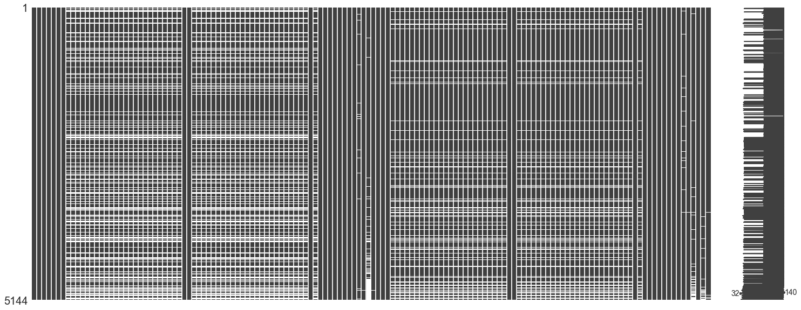


> This confirms my initial thoughts visually, I will check one last time by filtering those without W/L streaks. (It may be useful later to make a column for first fighters)

> Instead of making a new columns, for those without AVGs, I will fill them with 0's, to represent their 'UFC-only' stats. This could lead to issues later due to these fighters needing to have previous experience in MMA or combat sports in general. In order to net a spot on the fight card, it is likely there *is* data for them, but depending on numerous factors, in order to collect accurate data I would need to spend the time going through each individuals history. 

### Filling N/As 

Replacing Null Values: 
* B/R_avg... & total_time = 0
* B/R_Stance = random choice acc. to probability
* B/R_Reach = groupby Height and use mean
* B/R_Height = groupby Reach and use mean
* B/R_Weight = groupby weight class and use mean
* B/R_age = mean

#### Filling AVGs


```python
## Making list of cols to fill with 0 averages, then doing so
zero_fill_cols = [col for col in df.columns if 'avg' in col]

df_fill = df.copy()

df_fill[zero_fill_cols] = df_fill[zero_fill_cols].fillna(0)
```


```python
## Sanity check for filled nulls + visual

#pd.set_option('max_rows',None)
#print(df_fill.isna().sum())

mg.matrix(df_fill);
```


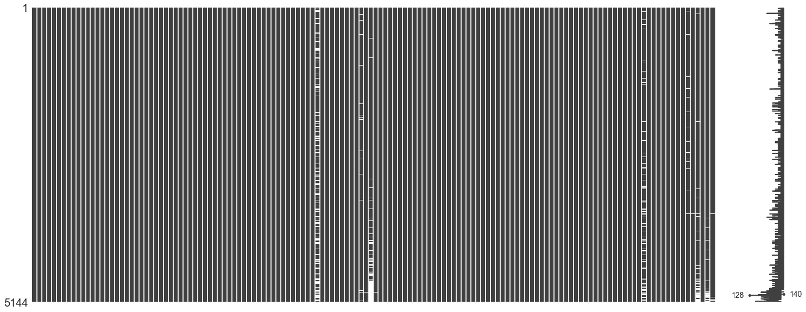


#### Filling Stances


```python
## Checking distributions pt.1

df_fill['B_Stance'].value_counts(normalize=True)
```


    Orthodox       0.768104
    Southpaw       0.195587
    Switch         0.033701
    Open Stance    0.001805
    Sideways       0.000802
    Name: B_Stance, dtype: float64


```python
## Checking distributions pt.2

df_fill['R_Stance'].value_counts(normalize=True)
```


    Orthodox       0.759880
    Southpaw       0.206786
    Switch         0.029940
    Open Stance    0.002994
    Sideways       0.000399
    Name: R_Stance, dtype: float64


```python
## Making list for random choices

stance_list = list(df_fill['B_Stance'].dropna().unique())
print(stance_list)

## Making array of probabilities for corresp. stances
stance_ps = df_fill['R_Stance'].value_counts(normalize=True).values
print(stance_ps)
```

    ['Orthodox', 'Switch', 'Southpaw', 'Open Stance', 'Sideways']
    [7.59880240e-01 2.06786427e-01 2.99401198e-02 2.99401198e-03
     3.99201597e-04]
    


```python
## Using for loop to randomly fill stances according to probabilities 
helper = ['B_Stance', 'R_Stance']

for col in helper:
    df_fill[col] = df_fill[col].fillna(np.random.choice(stance_list, p=stance_ps))
```


```python
## Sanity check again

#pd.set_option('max_rows',None)
#print(df_fill.isna().sum())

mg.matrix(df_fill);
```


> Its getting better bit by bit!

#### Filling Reach/Height/Weight


```python
## Using .groupby to find aggregrate stats for groups
height_grouped = df_fill.groupby('R_Height_cms').agg('mean')
display(height_grouped.head())

## Making dictionary of reach values acc. to height grouping
reach_by_height = dict(height_grouped['R_Reach_cms'])
display(reach_by_height)
```


<div>
<style scoped>
    .dataframe tbody tr th:only-of-type {
        vertical-align: middle;
    }

    .dataframe tbody tr th {
        vertical-align: top;
    }

    .dataframe thead th {
        text-align: right;
    }
</style>
<table border="1" class="dataframe">
  <thead>
    <tr style="text-align: right;">
      <th></th>
      <th>title_bout</th>
      <th>no_of_rounds</th>
      <th>B_current_lose_streak</th>
      <th>B_current_win_streak</th>
      <th>B_draw</th>
      <th>B_avg_BODY_att</th>
      <th>B_avg_BODY_landed</th>
      <th>B_avg_CLINCH_att</th>
      <th>B_avg_CLINCH_landed</th>
      <th>B_avg_DISTANCE_att</th>
      <th>...</th>
      <th>R_win_by_Decision_Split</th>
      <th>R_win_by_Decision_Unanimous</th>
      <th>R_win_by_KO/TKO</th>
      <th>R_win_by_Submission</th>
      <th>R_win_by_TKO_Doctor_Stoppage</th>
      <th>R_wins</th>
      <th>R_Reach_cms</th>
      <th>R_Weight_lbs</th>
      <th>B_age</th>
      <th>R_age</th>
    </tr>
    <tr>
      <th>R_Height_cms</th>
      <th></th>
      <th></th>
      <th></th>
      <th></th>
      <th></th>
      <th></th>
      <th></th>
      <th></th>
      <th></th>
      <th></th>
      <th></th>
      <th></th>
      <th></th>
      <th></th>
      <th></th>
      <th></th>
      <th></th>
      <th></th>
      <th></th>
      <th></th>
      <th></th>
    </tr>
  </thead>
  <tbody>
    <tr>
      <th>152.40</th>
      <td>0.000000</td>
      <td>3.000000</td>
      <td>0.000000</td>
      <td>0.500000</td>
      <td>0.0</td>
      <td>8.750000</td>
      <td>6.250000</td>
      <td>8.500000</td>
      <td>6.500000</td>
      <td>71.750000</td>
      <td>...</td>
      <td>1.000000</td>
      <td>1.000000</td>
      <td>0.000000</td>
      <td>0.000000</td>
      <td>0.000000</td>
      <td>2.000000</td>
      <td>152.400000</td>
      <td>115.000000</td>
      <td>26.500000</td>
      <td>28.000000</td>
    </tr>
    <tr>
      <th>154.94</th>
      <td>0.080000</td>
      <td>3.160000</td>
      <td>0.280000</td>
      <td>0.880000</td>
      <td>0.0</td>
      <td>12.076762</td>
      <td>8.322000</td>
      <td>14.464000</td>
      <td>10.693238</td>
      <td>64.446762</td>
      <td>...</td>
      <td>0.400000</td>
      <td>1.760000</td>
      <td>0.160000</td>
      <td>0.680000</td>
      <td>0.000000</td>
      <td>3.000000</td>
      <td>157.480000</td>
      <td>115.000000</td>
      <td>29.160000</td>
      <td>26.320000</td>
    </tr>
    <tr>
      <th>157.48</th>
      <td>0.000000</td>
      <td>3.000000</td>
      <td>0.714286</td>
      <td>0.142857</td>
      <td>0.0</td>
      <td>3.214286</td>
      <td>2.023810</td>
      <td>3.190476</td>
      <td>1.904762</td>
      <td>53.333333</td>
      <td>...</td>
      <td>0.000000</td>
      <td>0.428571</td>
      <td>0.000000</td>
      <td>0.285714</td>
      <td>0.000000</td>
      <td>0.714286</td>
      <td>160.745714</td>
      <td>117.857143</td>
      <td>29.714286</td>
      <td>28.285714</td>
    </tr>
    <tr>
      <th>160.02</th>
      <td>0.190476</td>
      <td>3.428571</td>
      <td>0.349206</td>
      <td>1.111111</td>
      <td>0.0</td>
      <td>12.551494</td>
      <td>7.979525</td>
      <td>8.324463</td>
      <td>5.644547</td>
      <td>64.666361</td>
      <td>...</td>
      <td>0.507937</td>
      <td>2.301587</td>
      <td>1.238095</td>
      <td>0.587302</td>
      <td>0.095238</td>
      <td>4.730159</td>
      <td>164.858095</td>
      <td>125.317460</td>
      <td>28.349206</td>
      <td>29.746032</td>
    </tr>
    <tr>
      <th>162.56</th>
      <td>0.035088</td>
      <td>3.105263</td>
      <td>0.324561</td>
      <td>0.754386</td>
      <td>0.0</td>
      <td>9.453106</td>
      <td>6.392813</td>
      <td>8.522069</td>
      <td>5.935818</td>
      <td>56.728987</td>
      <td>...</td>
      <td>0.219298</td>
      <td>1.666667</td>
      <td>0.473684</td>
      <td>0.394737</td>
      <td>0.000000</td>
      <td>2.754386</td>
      <td>164.987611</td>
      <td>124.561404</td>
      <td>28.552632</td>
      <td>29.245614</td>
    </tr>
  </tbody>
</table>
<p>5 rows × 135 columns</p>
</div>


    {152.4: 152.4,
     154.94: 157.48000000000002,
     157.48000000000005: 160.74571428571429,
     160.02: 164.85809523809536,
     162.56: 164.98761061946905,
     165.1: 167.62145985401455,
     167.64: 170.91507163323794,
     170.18: 175.6790572390578,
     172.72: 177.22211640211643,
     175.26: 179.98928870292895,
     177.8: 182.0478372591003,
     180.34: 185.68854625550645,
     182.88: 187.4072538860109,
     185.42: 189.98413080895023,
     187.96: 192.71544444444447,
     190.5: 196.16033112582835,
     193.04: 201.5994520547946,
     195.58: 199.31062499999993,
     198.12: 200.83517241379303,
     200.66: 205.74,
     203.2: 203.20000000000002,
     208.28: nan,
     210.82: 213.3600000000001}


```python
## Same as above but targeting Height values to be filled
reach_grouped = df_fill.groupby('R_Reach_cms').agg('mean')
#display(reach_grouped)

height_by_reach = dict(reach_grouped['R_Height_cms'])
display(height_by_reach)
```


    {152.4: 154.3755555555556,
     157.48: 157.3106666666667,
     160.02: 160.91370370370385,
     162.56: 163.75944444444448,
     165.1: 165.78914728682167,
     167.64: 166.22531645569606,
     170.18: 167.6562820512819,
     172.72: 170.93834532374112,
     175.26: 172.94302439024398,
     177.8: 174.06380761523002,
     180.34: 175.9309433962269,
     182.88: 179.5954137115838,
     185.42: 180.57549668874137,
     187.96: 183.25398773006103,
     190.5: 184.52804651162717,
     193.04: 185.64592991913685,
     195.58: 188.2499999999996,
     198.12: 189.06991596638656,
     200.66: 190.8122950819671,
     203.2: 192.7577777777779,
     205.74: 193.73272727272723,
     208.28: 194.30999999999997,
     210.82: 193.04,
     213.36: 201.29499999999996}


```python
## Targeting weight values to be filled
weight_cls_grouped = df_fill.groupby('weight_class').agg('mean')
#display(weight_cls_grouped)

weight_by_class = dict(weight_cls_grouped['R_Weight_lbs'])
display(weight_by_class)
```


    {'Bantamweight': 134.5778364116095,
     'Catch Weight': 183.5,
     'Featherweight': 145.80316742081448,
     'Flyweight': 127.13903743315508,
     'Heavyweight': 245.10453648915188,
     'Light Heavyweight': 202.5309381237525,
     'Lightweight': 155.99291497975707,
     'Middleweight': 184.72137931034482,
     'Open Weight': 224.5164835164835,
     'Welterweight': 170.312693498452,
     "Women's Bantamweight": 133.64864864864865,
     "Women's Featherweight": 145.0,
     "Women's Flyweight": 125.0,
     "Women's Strawweight": 116.53846153846153}


> At this point I have the corresponding values for average height and reach based upon each other respectively in addition to average weight by weight class in dictionaries. Next I will use the .map() method to apply them appropriately.


```python
## Scaffolding for filling of values

#df.B = df.B.fillna(df.A.map(dict))
```


```python
cols1 = ['B_Reach_cms', 'R_Reach_cms']

for col in cols1:
    df_fill[col] = df_fill[col].fillna(df_fill['R_Height_cms'].map(reach_by_height))
```


```python
cols2 = ['B_Height_cms', 'R_Height_cms']

for col in cols2:
    df_fill[col] = df_fill[col].fillna(df_fill['R_Reach_cms'].map(height_by_reach))
```


```python
cols3 = ['B_Weight_lbs', 'R_Weight_lbs']

for col in cols3:
    df_fill[col] = df_fill[col].fillna(df_fill['weight_class'].map(weight_by_class))
```


```python
mg.matrix(df_fill);
```


> Needing to fill values that did not have Height nor Reach to fill from dictionary


```python
## Locate the NAs Red corner

df_fill.loc[(pd.isnull(df_fill.R_Height_cms)), 'R_Height_cms']
```


    103    NaN
    3607   NaN
    5029   NaN
    5132   NaN
    Name: R_Height_cms, dtype: float64


```python
## Verifying both columns are NA

list2 = [103, 3607, 5029, 5132]
for idx in list2:
    display(df_fill.iloc[idx][['R_Height_cms', 'R_Reach_cms']])
```


    R_Height_cms    NaN
    R_Reach_cms     NaN
    Name: 103, dtype: object


    R_Height_cms    NaN
    R_Reach_cms     NaN
    Name: 3607, dtype: object


    R_Height_cms    NaN
    R_Reach_cms     NaN
    Name: 5029, dtype: object


    R_Height_cms    NaN
    R_Reach_cms     NaN
    Name: 5132, dtype: object


```python
## Locate the NAs Blue corner

df_fill.loc[(pd.isnull(df_fill.B_Height_cms)), 'B_Height_cms']
```


    4978   NaN
    5020   NaN
    5029   NaN
    5134   NaN
    Name: B_Height_cms, dtype: float64


```python
## Same as above

list3 = [4978, 5020, 5029, 5134]
for idx in list3:
    display(df_fill.iloc[idx][['B_Height_cms', 'B_Reach_cms']])
```


    B_Height_cms        NaN
    B_Reach_cms     185.689
    Name: 4978, dtype: object


    B_Height_cms        NaN
    B_Reach_cms     179.989
    Name: 5020, dtype: object


    B_Height_cms    NaN
    B_Reach_cms     NaN
    Name: 5029, dtype: object


    B_Height_cms        NaN
    B_Reach_cms     192.715
    Name: 5134, dtype: object


```python
## Sanity check on specific index/help to make strategy to fill others

print(df_fill.iloc[3607].isna().sum())
df_fill.iloc[3607][['weight_class', 'R_Reach_cms', 'R_Height_cms', 'B_Reach_cms', 'B_Height_cms']]
```

    4
    


    weight_class    Light Heavyweight
    R_Reach_cms                   NaN
    R_Height_cms                  NaN
    B_Reach_cms                 190.5
    B_Height_cms                190.5
    Name: 3607, dtype: object


```python
## Displaying values to fill according to each fight's weight class
## I have no other body attribute to go off of. 

display(weight_cls_grouped[['R_Reach_cms', 'R_Height_cms', 'B_Reach_cms', 'B_Height_cms']].iloc[8])
display(weight_cls_grouped[['R_Reach_cms', 'R_Height_cms', 'B_Reach_cms', 'B_Height_cms']].iloc[6])
display(weight_cls_grouped[['R_Reach_cms', 'R_Height_cms', 'B_Reach_cms', 'B_Height_cms']].iloc[5])
display(weight_cls_grouped[['R_Reach_cms', 'R_Height_cms', 'B_Reach_cms', 'B_Height_cms']].iloc[4])
```


    R_Reach_cms     186.690000
    R_Height_cms    186.424835
    B_Reach_cms     182.880000
    B_Height_cms    184.912000
    Name: Open Weight, dtype: float64


    R_Reach_cms     181.063807
    R_Height_cms    176.481154
    B_Reach_cms     181.392244
    B_Height_cms    176.603492
    Name: Lightweight, dtype: float64


    R_Reach_cms     192.831803
    R_Height_cms    187.137040
    B_Reach_cms     192.145874
    B_Height_cms    186.674821
    Name: Light Heavyweight, dtype: float64


    R_Reach_cms     196.393271
    R_Height_cms    189.773570
    B_Reach_cms     196.227178
    B_Height_cms    189.827352
    Name: Heavyweight, dtype: float64


> Values to fill:
* Row 103 : Light Heavy R_Reach/Height ..... 2
* Row 3607: Light Heavy R_Reach/Height .... 2
* Row 4978: Lightweight B_Height ................ 1
* Row 5020: Heavyweight B_Height .............. 1
* Row 5029: Lightweight B/R_Reach/Height .. 4
* Row 5132: Open Weight B/R_Reach:R_Height . 3
* Row 5134: Open Weight B_Height ........... 1


```python
## Creating dictionaries according to indices to fill the NAs from values above

val_R_rch = {103: 192.831803, 3607: 192.831803, 5029: 181.063807, 5132: 186.690000}
val_R_hgt = {103: 187.137040, 3607: 187.137040, 5029: 176.481154, 5132: 186.424835}

val_B_rch = {5029: 181.392244, 5132: 182.880000}
val_B_hgt = {4978: 176.603492, 5020: 189.827352, 5029: 176.603492, 5134: 184.912000}

## Filling each column acc. to dictionaries above
cols4 = ['R_Reach_cms', 'R_Height_cms', 'B_Reach_cms', 'B_Height_cms']

df_fill[cols4[0]] = df_fill[cols4[0]].fillna(val_R_rch)
df_fill[cols4[1]] = df_fill[cols4[1]].fillna(val_R_hgt)
df_fill[cols4[2]] = df_fill[cols4[2]].fillna(val_B_rch)
df_fill[cols4[3]] = df_fill[cols4[3]].fillna(val_B_hgt)
```


```python
mg.matrix(df_fill);
```


```python
#pd.set_option('max_rows', None)
```


```python
df_fill.isna().sum()
```


    Winner                            0
    title_bout                        0
    weight_class                      0
    no_of_rounds                      0
    B_current_lose_streak             0
    B_current_win_streak              0
    B_draw                            0
    B_avg_BODY_att                    0
    B_avg_BODY_landed                 0
    B_avg_CLINCH_att                  0
    B_avg_CLINCH_landed               0
    B_avg_DISTANCE_att                0
    B_avg_DISTANCE_landed             0
    B_avg_GROUND_att                  0
    B_avg_GROUND_landed               0
    B_avg_HEAD_att                    0
    B_avg_HEAD_landed                 0
    B_avg_KD                          0
    B_avg_LEG_att                     0
    B_avg_LEG_landed                  0
    B_avg_PASS                        0
    B_avg_REV                         0
    B_avg_SIG_STR_att                 0
    B_avg_SIG_STR_landed              0
    B_avg_SIG_STR_pct                 0
    B_avg_SUB_ATT                     0
    B_avg_TD_att                      0
    B_avg_TD_landed                   0
    B_avg_TD_pct                      0
    B_avg_TOTAL_STR_att               0
                                   ... 
    R_avg_opp_KD                      0
    R_avg_opp_LEG_att                 0
    R_avg_opp_LEG_landed              0
    R_avg_opp_PASS                    0
    R_avg_opp_REV                     0
    R_avg_opp_SIG_STR_att             0
    R_avg_opp_SIG_STR_landed          0
    R_avg_opp_SIG_STR_pct             0
    R_avg_opp_SUB_ATT                 0
    R_avg_opp_TD_att                  0
    R_avg_opp_TD_landed               0
    R_avg_opp_TD_pct                  0
    R_avg_opp_TOTAL_STR_att           0
    R_avg_opp_TOTAL_STR_landed        0
    R_total_rounds_fought             0
    R_total_time_fought(seconds)    650
    R_total_title_bouts               0
    R_win_by_Decision_Majority        0
    R_win_by_Decision_Split           0
    R_win_by_Decision_Unanimous       0
    R_win_by_KO/TKO                   0
    R_win_by_Submission               0
    R_win_by_TKO_Doctor_Stoppage      0
    R_wins                            0
    R_Stance                          0
    R_Height_cms                      0
    R_Reach_cms                       3
    R_Weight_lbs                      0
    B_age                           172
    R_age                            64
    Length: 140, dtype: int64


> Almost there!


```python
## Finding the rest

display(df_fill.loc[(pd.isnull(df_fill.R_Reach_cms)), 'R_Reach_cms'])
display(df_fill.loc[(pd.isnull(df_fill.B_Reach_cms)), 'B_Reach_cms'])
```


    4800   NaN
    4814   NaN
    4883   NaN
    Name: R_Reach_cms, dtype: float64


    4800   NaN
    4814   NaN
    4883   NaN
    Name: B_Reach_cms, dtype: float64


> I am going to find the weight classes and confirm the values I need to fill.


```python
print(df_fill.iloc[4800].isna().sum())
df_fill.iloc[4800][['weight_class', 'R_Reach_cms', 'B_Reach_cms']]
```

    2
    


    weight_class    Heavyweight
    R_Reach_cms             NaN
    B_Reach_cms             NaN
    Name: 4800, dtype: object


```python
print(df_fill.iloc[4814].isna().sum())
df_fill.iloc[4814][['weight_class', 'R_Reach_cms', 'B_Reach_cms']]
```

    2
    


    weight_class    Heavyweight
    R_Reach_cms             NaN
    B_Reach_cms             NaN
    Name: 4814, dtype: object


```python
print(df_fill.iloc[4883].isna().sum())
df_fill.iloc[4883][['weight_class', 'R_Reach_cms', 'B_Reach_cms']]
```

    3
    


    weight_class    Heavyweight
    R_Reach_cms             NaN
    B_Reach_cms             NaN
    Name: 4883, dtype: object


```python
## Grabbing avgs. from groupby to fill with

display(weight_cls_grouped[['R_Reach_cms', 'B_Reach_cms']].iloc[4])
```


    R_Reach_cms    196.393271
    B_Reach_cms    196.227178
    Name: Heavyweight, dtype: float64


```python
## Same as above

val_R_rch2 = {4800: 196.393271, 4814: 196.393271, 4883: 196.393271}
val_B_rch2 = {4800: 196.227178, 4814: 196.227178, 4883: 196.227178}

## For reference
#cols4 = ['R_Reach_cms', 'R_Height_cms', 'B_Reach_cms', 'B_Height_cms']

df_fill[cols4[0]] = df_fill[cols4[0]].fillna(val_R_rch2)
df_fill[cols4[2]] = df_fill[cols4[2]].fillna(val_B_rch2)
```


```python
#pd.set_option('max_rows', None)
```


```python
df_fill.isna().sum()
```


    Winner                            0
    title_bout                        0
    weight_class                      0
    no_of_rounds                      0
    B_current_lose_streak             0
    B_current_win_streak              0
    B_draw                            0
    B_avg_BODY_att                    0
    B_avg_BODY_landed                 0
    B_avg_CLINCH_att                  0
    B_avg_CLINCH_landed               0
    B_avg_DISTANCE_att                0
    B_avg_DISTANCE_landed             0
    B_avg_GROUND_att                  0
    B_avg_GROUND_landed               0
    B_avg_HEAD_att                    0
    B_avg_HEAD_landed                 0
    B_avg_KD                          0
    B_avg_LEG_att                     0
    B_avg_LEG_landed                  0
    B_avg_PASS                        0
    B_avg_REV                         0
    B_avg_SIG_STR_att                 0
    B_avg_SIG_STR_landed              0
    B_avg_SIG_STR_pct                 0
    B_avg_SUB_ATT                     0
    B_avg_TD_att                      0
    B_avg_TD_landed                   0
    B_avg_TD_pct                      0
    B_avg_TOTAL_STR_att               0
                                   ... 
    R_avg_opp_KD                      0
    R_avg_opp_LEG_att                 0
    R_avg_opp_LEG_landed              0
    R_avg_opp_PASS                    0
    R_avg_opp_REV                     0
    R_avg_opp_SIG_STR_att             0
    R_avg_opp_SIG_STR_landed          0
    R_avg_opp_SIG_STR_pct             0
    R_avg_opp_SUB_ATT                 0
    R_avg_opp_TD_att                  0
    R_avg_opp_TD_landed               0
    R_avg_opp_TD_pct                  0
    R_avg_opp_TOTAL_STR_att           0
    R_avg_opp_TOTAL_STR_landed        0
    R_total_rounds_fought             0
    R_total_time_fought(seconds)    650
    R_total_title_bouts               0
    R_win_by_Decision_Majority        0
    R_win_by_Decision_Split           0
    R_win_by_Decision_Unanimous       0
    R_win_by_KO/TKO                   0
    R_win_by_Submission               0
    R_win_by_TKO_Doctor_Stoppage      0
    R_wins                            0
    R_Stance                          0
    R_Height_cms                      0
    R_Reach_cms                       0
    R_Weight_lbs                      0
    B_age                           172
    R_age                            64
    Length: 140, dtype: int64


```python
mg.matrix(df_fill);
```


#### Filling Age


```python
## Creating variable to hold age mean for filling
print(df_fill[['B_age', 'R_age']].mean())

## Taking midpoint between two columns
age_mean = (df_fill['B_age'].mean() + df_fill['R_age'].mean()) / 2
age_mean
```

    B_age    29.171963
    R_age    29.442323
    dtype: float64
    


    29.307142913702563


```python
## Filling with mean age

df_fill['B_age'] = df_fill['B_age'].fillna(age_mean)
df_fill['R_age'] = df_fill['R_age'].fillna(age_mean)
```

> Filled age with mean, looking at those rows, generally speaking, it appears that first time fighters are the culprit again. This may have to do with the lack of preplanning or rescheduling due to injury.


```python
## Visual check

mg.matrix(df_fill);
```


#### Filling Total Time Fought


```python
## Filling with zeros for first time fighters

df_fill['R_total_time_fought(seconds)'] = df_fill['R_total_time_fought(seconds)'].fillna(0)
df_fill['B_total_time_fought(seconds)'] = df_fill['B_total_time_fought(seconds)'].fillna(0)
```


```python
## Null check

#print(df_fill.isna().sum())
mg.matrix(df_fill);
```


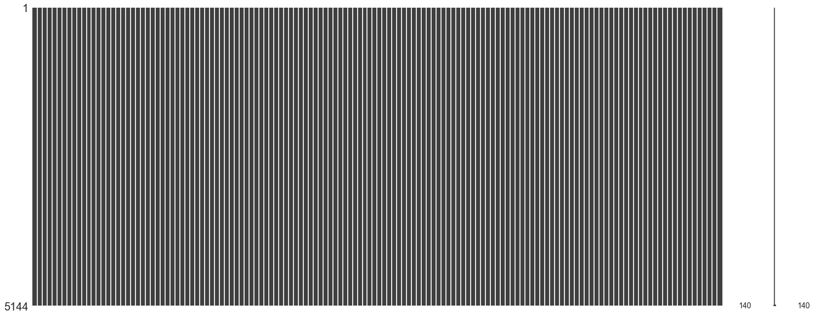


> Finally done!

#### Encoding Categorical Features


```python
## Check for categories and peek at Df

print(df_fill.info())
df_fill.select_dtypes(['object', 'bool']).head()
```

    <class 'pandas.core.frame.DataFrame'>
    RangeIndex: 5144 entries, 0 to 5143
    Columns: 140 entries, Winner to R_age
    dtypes: bool(1), float64(134), int64(1), object(4)
    memory usage: 5.5+ MB
    None
    


<div>
<style scoped>
    .dataframe tbody tr th:only-of-type {
        vertical-align: middle;
    }

    .dataframe tbody tr th {
        vertical-align: top;
    }

    .dataframe thead th {
        text-align: right;
    }
</style>
<table border="1" class="dataframe">
  <thead>
    <tr style="text-align: right;">
      <th></th>
      <th>Winner</th>
      <th>title_bout</th>
      <th>weight_class</th>
      <th>B_Stance</th>
      <th>R_Stance</th>
    </tr>
  </thead>
  <tbody>
    <tr>
      <th>0</th>
      <td>Red</td>
      <td>True</td>
      <td>Bantamweight</td>
      <td>Orthodox</td>
      <td>Orthodox</td>
    </tr>
    <tr>
      <th>1</th>
      <td>Red</td>
      <td>True</td>
      <td>Women's Flyweight</td>
      <td>Orthodox</td>
      <td>Southpaw</td>
    </tr>
    <tr>
      <th>2</th>
      <td>Red</td>
      <td>False</td>
      <td>Lightweight</td>
      <td>Orthodox</td>
      <td>Orthodox</td>
    </tr>
    <tr>
      <th>3</th>
      <td>Blue</td>
      <td>False</td>
      <td>Bantamweight</td>
      <td>Switch</td>
      <td>Orthodox</td>
    </tr>
    <tr>
      <th>4</th>
      <td>Blue</td>
      <td>False</td>
      <td>Heavyweight</td>
      <td>Southpaw</td>
      <td>Southpaw</td>
    </tr>
  </tbody>
</table>
</div>


```python
## Encoding categorical columns

cat_df = df_fill.select_dtypes(['object', 'bool']).copy()
dummy_df = pd.get_dummies(cat_df)

## Dropping title to reintroduce as an int and Winner as label encoded

dummy_df.drop(columns=['title_bout', 'Winner_Blue', 'Winner_Draw', 'Winner_Red'], inplace=True)
dummy_df.head()
```


<div>
<style scoped>
    .dataframe tbody tr th:only-of-type {
        vertical-align: middle;
    }

    .dataframe tbody tr th {
        vertical-align: top;
    }

    .dataframe thead th {
        text-align: right;
    }
</style>
<table border="1" class="dataframe">
  <thead>
    <tr style="text-align: right;">
      <th></th>
      <th>weight_class_Bantamweight</th>
      <th>weight_class_Catch Weight</th>
      <th>weight_class_Featherweight</th>
      <th>weight_class_Flyweight</th>
      <th>weight_class_Heavyweight</th>
      <th>weight_class_Light Heavyweight</th>
      <th>weight_class_Lightweight</th>
      <th>weight_class_Middleweight</th>
      <th>weight_class_Open Weight</th>
      <th>weight_class_Welterweight</th>
      <th>...</th>
      <th>B_Stance_Open Stance</th>
      <th>B_Stance_Orthodox</th>
      <th>B_Stance_Sideways</th>
      <th>B_Stance_Southpaw</th>
      <th>B_Stance_Switch</th>
      <th>R_Stance_Open Stance</th>
      <th>R_Stance_Orthodox</th>
      <th>R_Stance_Sideways</th>
      <th>R_Stance_Southpaw</th>
      <th>R_Stance_Switch</th>
    </tr>
  </thead>
  <tbody>
    <tr>
      <th>0</th>
      <td>1</td>
      <td>0</td>
      <td>0</td>
      <td>0</td>
      <td>0</td>
      <td>0</td>
      <td>0</td>
      <td>0</td>
      <td>0</td>
      <td>0</td>
      <td>...</td>
      <td>0</td>
      <td>1</td>
      <td>0</td>
      <td>0</td>
      <td>0</td>
      <td>0</td>
      <td>1</td>
      <td>0</td>
      <td>0</td>
      <td>0</td>
    </tr>
    <tr>
      <th>1</th>
      <td>0</td>
      <td>0</td>
      <td>0</td>
      <td>0</td>
      <td>0</td>
      <td>0</td>
      <td>0</td>
      <td>0</td>
      <td>0</td>
      <td>0</td>
      <td>...</td>
      <td>0</td>
      <td>1</td>
      <td>0</td>
      <td>0</td>
      <td>0</td>
      <td>0</td>
      <td>0</td>
      <td>0</td>
      <td>1</td>
      <td>0</td>
    </tr>
    <tr>
      <th>2</th>
      <td>0</td>
      <td>0</td>
      <td>0</td>
      <td>0</td>
      <td>0</td>
      <td>0</td>
      <td>1</td>
      <td>0</td>
      <td>0</td>
      <td>0</td>
      <td>...</td>
      <td>0</td>
      <td>1</td>
      <td>0</td>
      <td>0</td>
      <td>0</td>
      <td>0</td>
      <td>1</td>
      <td>0</td>
      <td>0</td>
      <td>0</td>
    </tr>
    <tr>
      <th>3</th>
      <td>1</td>
      <td>0</td>
      <td>0</td>
      <td>0</td>
      <td>0</td>
      <td>0</td>
      <td>0</td>
      <td>0</td>
      <td>0</td>
      <td>0</td>
      <td>...</td>
      <td>0</td>
      <td>0</td>
      <td>0</td>
      <td>0</td>
      <td>1</td>
      <td>0</td>
      <td>1</td>
      <td>0</td>
      <td>0</td>
      <td>0</td>
    </tr>
    <tr>
      <th>4</th>
      <td>0</td>
      <td>0</td>
      <td>0</td>
      <td>0</td>
      <td>1</td>
      <td>0</td>
      <td>0</td>
      <td>0</td>
      <td>0</td>
      <td>0</td>
      <td>...</td>
      <td>0</td>
      <td>0</td>
      <td>0</td>
      <td>1</td>
      <td>0</td>
      <td>0</td>
      <td>0</td>
      <td>0</td>
      <td>1</td>
      <td>0</td>
    </tr>
  </tbody>
</table>
<p>5 rows × 24 columns</p>
</div>


```python
## Series to label encoding winner column

win_series = cat_df['Winner'].copy()
dict_win = {'Draw': 0, 'Red': 1, 'Blue': 2}
win_series = win_series.map(dict_win)
win_series.value_counts()
```


    1    3470
    2    1591
    0      83
    Name: Winner, dtype: int64


```python
## Same as winner column

title_series = cat_df['title_bout'].copy()
dict_title = {True: 1, False: 0}
title_series = title_series.map(dict_title)
title_series.head()
```


    0    1
    1    1
    2    0
    3    0
    4    0
    Name: title_bout, dtype: int64


```python
## Helper for code length

drop_cols = ['Winner', 'title_bout', 'B_Stance', 'R_Stance', 'weight_class']
```


```python
## Putting it back together

df_full = pd.concat([df_fill.drop(columns=drop_cols), win_series, title_series, dummy_df], axis=1)
df_full.head()
```


<div>
<style scoped>
    .dataframe tbody tr th:only-of-type {
        vertical-align: middle;
    }

    .dataframe tbody tr th {
        vertical-align: top;
    }

    .dataframe thead th {
        text-align: right;
    }
</style>
<table border="1" class="dataframe">
  <thead>
    <tr style="text-align: right;">
      <th></th>
      <th>no_of_rounds</th>
      <th>B_current_lose_streak</th>
      <th>B_current_win_streak</th>
      <th>B_draw</th>
      <th>B_avg_BODY_att</th>
      <th>B_avg_BODY_landed</th>
      <th>B_avg_CLINCH_att</th>
      <th>B_avg_CLINCH_landed</th>
      <th>B_avg_DISTANCE_att</th>
      <th>B_avg_DISTANCE_landed</th>
      <th>...</th>
      <th>B_Stance_Open Stance</th>
      <th>B_Stance_Orthodox</th>
      <th>B_Stance_Sideways</th>
      <th>B_Stance_Southpaw</th>
      <th>B_Stance_Switch</th>
      <th>R_Stance_Open Stance</th>
      <th>R_Stance_Orthodox</th>
      <th>R_Stance_Sideways</th>
      <th>R_Stance_Southpaw</th>
      <th>R_Stance_Switch</th>
    </tr>
  </thead>
  <tbody>
    <tr>
      <th>0</th>
      <td>5</td>
      <td>0.0</td>
      <td>4.0</td>
      <td>0.0</td>
      <td>9.200000</td>
      <td>6.000000</td>
      <td>0.200000</td>
      <td>0.000000</td>
      <td>62.600000</td>
      <td>20.600000</td>
      <td>...</td>
      <td>0</td>
      <td>1</td>
      <td>0</td>
      <td>0</td>
      <td>0</td>
      <td>0</td>
      <td>1</td>
      <td>0</td>
      <td>0</td>
      <td>0</td>
    </tr>
    <tr>
      <th>1</th>
      <td>5</td>
      <td>0.0</td>
      <td>3.0</td>
      <td>0.0</td>
      <td>14.600000</td>
      <td>9.100000</td>
      <td>11.800000</td>
      <td>7.300000</td>
      <td>124.700000</td>
      <td>42.100000</td>
      <td>...</td>
      <td>0</td>
      <td>1</td>
      <td>0</td>
      <td>0</td>
      <td>0</td>
      <td>0</td>
      <td>0</td>
      <td>0</td>
      <td>1</td>
      <td>0</td>
    </tr>
    <tr>
      <th>2</th>
      <td>3</td>
      <td>0.0</td>
      <td>3.0</td>
      <td>0.0</td>
      <td>15.354839</td>
      <td>11.322581</td>
      <td>6.741935</td>
      <td>4.387097</td>
      <td>84.741935</td>
      <td>38.580645</td>
      <td>...</td>
      <td>0</td>
      <td>1</td>
      <td>0</td>
      <td>0</td>
      <td>0</td>
      <td>0</td>
      <td>1</td>
      <td>0</td>
      <td>0</td>
      <td>0</td>
    </tr>
    <tr>
      <th>3</th>
      <td>3</td>
      <td>0.0</td>
      <td>4.0</td>
      <td>0.0</td>
      <td>17.000000</td>
      <td>14.000000</td>
      <td>13.750000</td>
      <td>11.000000</td>
      <td>109.500000</td>
      <td>48.750000</td>
      <td>...</td>
      <td>0</td>
      <td>0</td>
      <td>0</td>
      <td>0</td>
      <td>1</td>
      <td>0</td>
      <td>1</td>
      <td>0</td>
      <td>0</td>
      <td>0</td>
    </tr>
    <tr>
      <th>4</th>
      <td>3</td>
      <td>0.0</td>
      <td>1.0</td>
      <td>0.0</td>
      <td>17.000000</td>
      <td>14.500000</td>
      <td>2.500000</td>
      <td>2.000000</td>
      <td>201.000000</td>
      <td>59.500000</td>
      <td>...</td>
      <td>0</td>
      <td>0</td>
      <td>0</td>
      <td>1</td>
      <td>0</td>
      <td>0</td>
      <td>0</td>
      <td>0</td>
      <td>1</td>
      <td>0</td>
    </tr>
  </tbody>
</table>
<p>5 rows × 161 columns</p>
</div>


```python
df_full.info()
```

    <class 'pandas.core.frame.DataFrame'>
    RangeIndex: 5144 entries, 0 to 5143
    Columns: 161 entries, no_of_rounds to R_Stance_Switch
    dtypes: float64(134), int64(3), uint8(24)
    memory usage: 5.5 MB
    


```python
## Set up for quick visual check of multicollinearity

corr_test = df_full.corr()
```


```python
fig, ax = plt.subplots(figsize=(12,12))

sns.heatmap(corr_test, vmin=-1, vmax=1, center=0, 
            cmap=sns.diverging_palette(20, 220, n=200), square=True)

ax.set_xticklabels(ax.get_xticklabels(), rotation=45, 
                   horizontalalignment='right');
```


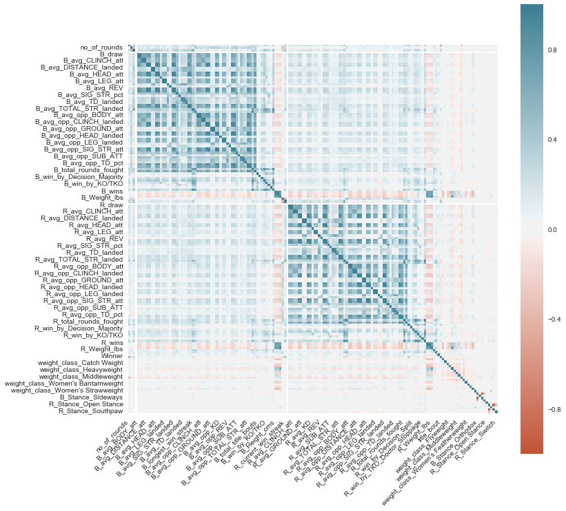


> AVGS show some correlation, but nothing demonstrates a strong connection to the winner category

### Final Prep for Model

#### Creating a Scaled Version

> In order to explore different types of models, it is imperative to scale data to allow for proper calculations.


```python
## Separate features from target to train-test split

X = df_full.drop('Winner', axis=1).copy()
y = df_full['Winner'].copy()

X_train, X_test, y_train, y_test = train_test_split(X, y, random_state=22)
```

> I performed the split *prior* to scaling to prevent leakage into my test data set


```python
## Verifying class balance is roughly the same

print('Original Class Balance')
display(y.value_counts(normalize=True))
print('y_train Class Balance')
display(y_train.value_counts(normalize=True))
print('y_test Class Balance')
display(y_test.value_counts(normalize=True))
```

    Original Class Balance
    


    1    0.674572
    2    0.309292
    0    0.016135
    Name: Winner, dtype: float64


    y_train Class Balance
    


    1    0.680404
    2    0.304044
    0    0.015552
    Name: Winner, dtype: float64


    y_test Class Balance
    


    1    0.657076
    2    0.325039
    0    0.017885
    Name: Winner, dtype: float64


```python
## Instantiate scaler and fit_transform to training only

scaler = MinMaxScaler()

X_train_sca = pd.DataFrame(scaler.fit_transform(X_train), columns=X_train.columns,
                           index=X_train.index)
X_test_sca = pd.DataFrame(scaler.transform(X_test), columns=X_test.columns, 
                          index=X_test.index)

## Check for scaling

display(X_train_sca.head())
display(X_train_sca.describe().loc[['min', 'max']])
display(X_test_sca.head())
display(X_test_sca.describe().loc[['min', 'max']])
```


<div>
<style scoped>
    .dataframe tbody tr th:only-of-type {
        vertical-align: middle;
    }

    .dataframe tbody tr th {
        vertical-align: top;
    }

    .dataframe thead th {
        text-align: right;
    }
</style>
<table border="1" class="dataframe">
  <thead>
    <tr style="text-align: right;">
      <th></th>
      <th>no_of_rounds</th>
      <th>B_current_lose_streak</th>
      <th>B_current_win_streak</th>
      <th>B_draw</th>
      <th>B_avg_BODY_att</th>
      <th>B_avg_BODY_landed</th>
      <th>B_avg_CLINCH_att</th>
      <th>B_avg_CLINCH_landed</th>
      <th>B_avg_DISTANCE_att</th>
      <th>B_avg_DISTANCE_landed</th>
      <th>...</th>
      <th>B_Stance_Open Stance</th>
      <th>B_Stance_Orthodox</th>
      <th>B_Stance_Sideways</th>
      <th>B_Stance_Southpaw</th>
      <th>B_Stance_Switch</th>
      <th>R_Stance_Open Stance</th>
      <th>R_Stance_Orthodox</th>
      <th>R_Stance_Sideways</th>
      <th>R_Stance_Southpaw</th>
      <th>R_Stance_Switch</th>
    </tr>
  </thead>
  <tbody>
    <tr>
      <th>2898</th>
      <td>1.0</td>
      <td>0.0</td>
      <td>0.076923</td>
      <td>0.0</td>
      <td>0.167347</td>
      <td>0.164103</td>
      <td>0.062069</td>
      <td>0.050000</td>
      <td>0.325461</td>
      <td>0.262009</td>
      <td>...</td>
      <td>0.0</td>
      <td>1.0</td>
      <td>0.0</td>
      <td>0.0</td>
      <td>0.0</td>
      <td>0.0</td>
      <td>1.0</td>
      <td>0.0</td>
      <td>0.0</td>
      <td>0.0</td>
    </tr>
    <tr>
      <th>1358</th>
      <td>0.5</td>
      <td>0.0</td>
      <td>0.000000</td>
      <td>0.0</td>
      <td>0.000000</td>
      <td>0.000000</td>
      <td>0.000000</td>
      <td>0.000000</td>
      <td>0.000000</td>
      <td>0.000000</td>
      <td>...</td>
      <td>0.0</td>
      <td>1.0</td>
      <td>0.0</td>
      <td>0.0</td>
      <td>0.0</td>
      <td>0.0</td>
      <td>1.0</td>
      <td>0.0</td>
      <td>0.0</td>
      <td>0.0</td>
    </tr>
    <tr>
      <th>2510</th>
      <td>0.5</td>
      <td>0.0</td>
      <td>0.230769</td>
      <td>0.0</td>
      <td>0.292517</td>
      <td>0.247863</td>
      <td>0.045977</td>
      <td>0.039216</td>
      <td>0.554736</td>
      <td>0.509461</td>
      <td>...</td>
      <td>0.0</td>
      <td>1.0</td>
      <td>0.0</td>
      <td>0.0</td>
      <td>0.0</td>
      <td>0.0</td>
      <td>1.0</td>
      <td>0.0</td>
      <td>0.0</td>
      <td>0.0</td>
    </tr>
    <tr>
      <th>1181</th>
      <td>0.5</td>
      <td>0.0</td>
      <td>0.230769</td>
      <td>0.0</td>
      <td>0.119898</td>
      <td>0.073718</td>
      <td>0.043103</td>
      <td>0.034926</td>
      <td>0.193727</td>
      <td>0.117904</td>
      <td>...</td>
      <td>0.0</td>
      <td>1.0</td>
      <td>0.0</td>
      <td>0.0</td>
      <td>0.0</td>
      <td>0.0</td>
      <td>1.0</td>
      <td>0.0</td>
      <td>0.0</td>
      <td>0.0</td>
    </tr>
    <tr>
      <th>4583</th>
      <td>0.5</td>
      <td>0.0</td>
      <td>0.000000</td>
      <td>0.0</td>
      <td>0.000000</td>
      <td>0.000000</td>
      <td>0.000000</td>
      <td>0.000000</td>
      <td>0.000000</td>
      <td>0.000000</td>
      <td>...</td>
      <td>0.0</td>
      <td>1.0</td>
      <td>0.0</td>
      <td>0.0</td>
      <td>0.0</td>
      <td>0.0</td>
      <td>1.0</td>
      <td>0.0</td>
      <td>0.0</td>
      <td>0.0</td>
    </tr>
  </tbody>
</table>
<p>5 rows × 160 columns</p>
</div>


<div>
<style scoped>
    .dataframe tbody tr th:only-of-type {
        vertical-align: middle;
    }

    .dataframe tbody tr th {
        vertical-align: top;
    }

    .dataframe thead th {
        text-align: right;
    }
</style>
<table border="1" class="dataframe">
  <thead>
    <tr style="text-align: right;">
      <th></th>
      <th>no_of_rounds</th>
      <th>B_current_lose_streak</th>
      <th>B_current_win_streak</th>
      <th>B_draw</th>
      <th>B_avg_BODY_att</th>
      <th>B_avg_BODY_landed</th>
      <th>B_avg_CLINCH_att</th>
      <th>B_avg_CLINCH_landed</th>
      <th>B_avg_DISTANCE_att</th>
      <th>B_avg_DISTANCE_landed</th>
      <th>...</th>
      <th>B_Stance_Open Stance</th>
      <th>B_Stance_Orthodox</th>
      <th>B_Stance_Sideways</th>
      <th>B_Stance_Southpaw</th>
      <th>B_Stance_Switch</th>
      <th>R_Stance_Open Stance</th>
      <th>R_Stance_Orthodox</th>
      <th>R_Stance_Sideways</th>
      <th>R_Stance_Southpaw</th>
      <th>R_Stance_Switch</th>
    </tr>
  </thead>
  <tbody>
    <tr>
      <th>min</th>
      <td>0.0</td>
      <td>0.0</td>
      <td>0.0</td>
      <td>0.0</td>
      <td>0.0</td>
      <td>0.0</td>
      <td>0.0</td>
      <td>0.0</td>
      <td>0.0</td>
      <td>0.0</td>
      <td>...</td>
      <td>0.0</td>
      <td>0.0</td>
      <td>0.0</td>
      <td>0.0</td>
      <td>0.0</td>
      <td>0.0</td>
      <td>0.0</td>
      <td>0.0</td>
      <td>0.0</td>
      <td>0.0</td>
    </tr>
    <tr>
      <th>max</th>
      <td>1.0</td>
      <td>1.0</td>
      <td>1.0</td>
      <td>0.0</td>
      <td>1.0</td>
      <td>1.0</td>
      <td>1.0</td>
      <td>1.0</td>
      <td>1.0</td>
      <td>1.0</td>
      <td>...</td>
      <td>1.0</td>
      <td>1.0</td>
      <td>1.0</td>
      <td>1.0</td>
      <td>1.0</td>
      <td>1.0</td>
      <td>1.0</td>
      <td>1.0</td>
      <td>1.0</td>
      <td>1.0</td>
    </tr>
  </tbody>
</table>
<p>2 rows × 160 columns</p>
</div>


<div>
<style scoped>
    .dataframe tbody tr th:only-of-type {
        vertical-align: middle;
    }

    .dataframe tbody tr th {
        vertical-align: top;
    }

    .dataframe thead th {
        text-align: right;
    }
</style>
<table border="1" class="dataframe">
  <thead>
    <tr style="text-align: right;">
      <th></th>
      <th>no_of_rounds</th>
      <th>B_current_lose_streak</th>
      <th>B_current_win_streak</th>
      <th>B_draw</th>
      <th>B_avg_BODY_att</th>
      <th>B_avg_BODY_landed</th>
      <th>B_avg_CLINCH_att</th>
      <th>B_avg_CLINCH_landed</th>
      <th>B_avg_DISTANCE_att</th>
      <th>B_avg_DISTANCE_landed</th>
      <th>...</th>
      <th>B_Stance_Open Stance</th>
      <th>B_Stance_Orthodox</th>
      <th>B_Stance_Sideways</th>
      <th>B_Stance_Southpaw</th>
      <th>B_Stance_Switch</th>
      <th>R_Stance_Open Stance</th>
      <th>R_Stance_Orthodox</th>
      <th>R_Stance_Sideways</th>
      <th>R_Stance_Southpaw</th>
      <th>R_Stance_Switch</th>
    </tr>
  </thead>
  <tbody>
    <tr>
      <th>1899</th>
      <td>0.5</td>
      <td>0.166667</td>
      <td>0.000000</td>
      <td>0.0</td>
      <td>0.104308</td>
      <td>0.095442</td>
      <td>0.075990</td>
      <td>0.070261</td>
      <td>0.114801</td>
      <td>0.116934</td>
      <td>...</td>
      <td>0.0</td>
      <td>1.0</td>
      <td>0.0</td>
      <td>0.0</td>
      <td>0.0</td>
      <td>0.0</td>
      <td>0.0</td>
      <td>0.0</td>
      <td>1.0</td>
      <td>0.0</td>
    </tr>
    <tr>
      <th>4061</th>
      <td>0.5</td>
      <td>0.000000</td>
      <td>0.000000</td>
      <td>0.0</td>
      <td>0.000000</td>
      <td>0.000000</td>
      <td>0.000000</td>
      <td>0.000000</td>
      <td>0.000000</td>
      <td>0.000000</td>
      <td>...</td>
      <td>0.0</td>
      <td>1.0</td>
      <td>0.0</td>
      <td>0.0</td>
      <td>0.0</td>
      <td>0.0</td>
      <td>1.0</td>
      <td>0.0</td>
      <td>0.0</td>
      <td>0.0</td>
    </tr>
    <tr>
      <th>1831</th>
      <td>1.0</td>
      <td>0.000000</td>
      <td>0.384615</td>
      <td>0.0</td>
      <td>0.061224</td>
      <td>0.043393</td>
      <td>0.045977</td>
      <td>0.032805</td>
      <td>0.150724</td>
      <td>0.104132</td>
      <td>...</td>
      <td>0.0</td>
      <td>1.0</td>
      <td>0.0</td>
      <td>0.0</td>
      <td>0.0</td>
      <td>0.0</td>
      <td>1.0</td>
      <td>0.0</td>
      <td>0.0</td>
      <td>0.0</td>
    </tr>
    <tr>
      <th>1788</th>
      <td>0.5</td>
      <td>0.166667</td>
      <td>0.000000</td>
      <td>0.0</td>
      <td>0.215743</td>
      <td>0.179487</td>
      <td>0.067323</td>
      <td>0.046218</td>
      <td>0.191355</td>
      <td>0.193387</td>
      <td>...</td>
      <td>0.0</td>
      <td>1.0</td>
      <td>0.0</td>
      <td>0.0</td>
      <td>0.0</td>
      <td>0.0</td>
      <td>1.0</td>
      <td>0.0</td>
      <td>0.0</td>
      <td>0.0</td>
    </tr>
    <tr>
      <th>5088</th>
      <td>0.0</td>
      <td>0.000000</td>
      <td>0.000000</td>
      <td>0.0</td>
      <td>0.000000</td>
      <td>0.000000</td>
      <td>0.000000</td>
      <td>0.000000</td>
      <td>0.000000</td>
      <td>0.000000</td>
      <td>...</td>
      <td>0.0</td>
      <td>1.0</td>
      <td>0.0</td>
      <td>0.0</td>
      <td>0.0</td>
      <td>0.0</td>
      <td>1.0</td>
      <td>0.0</td>
      <td>0.0</td>
      <td>0.0</td>
    </tr>
  </tbody>
</table>
<p>5 rows × 160 columns</p>
</div>


<div>
<style scoped>
    .dataframe tbody tr th:only-of-type {
        vertical-align: middle;
    }

    .dataframe tbody tr th {
        vertical-align: top;
    }

    .dataframe thead th {
        text-align: right;
    }
</style>
<table border="1" class="dataframe">
  <thead>
    <tr style="text-align: right;">
      <th></th>
      <th>no_of_rounds</th>
      <th>B_current_lose_streak</th>
      <th>B_current_win_streak</th>
      <th>B_draw</th>
      <th>B_avg_BODY_att</th>
      <th>B_avg_BODY_landed</th>
      <th>B_avg_CLINCH_att</th>
      <th>B_avg_CLINCH_landed</th>
      <th>B_avg_DISTANCE_att</th>
      <th>B_avg_DISTANCE_landed</th>
      <th>...</th>
      <th>B_Stance_Open Stance</th>
      <th>B_Stance_Orthodox</th>
      <th>B_Stance_Sideways</th>
      <th>B_Stance_Southpaw</th>
      <th>B_Stance_Switch</th>
      <th>R_Stance_Open Stance</th>
      <th>R_Stance_Orthodox</th>
      <th>R_Stance_Sideways</th>
      <th>R_Stance_Southpaw</th>
      <th>R_Stance_Switch</th>
    </tr>
  </thead>
  <tbody>
    <tr>
      <th>min</th>
      <td>0.0</td>
      <td>0.000000</td>
      <td>0.000000</td>
      <td>0.0</td>
      <td>0.000000</td>
      <td>0.000000</td>
      <td>0.00000</td>
      <td>0.000000</td>
      <td>0.0</td>
      <td>0.000000</td>
      <td>...</td>
      <td>0.0</td>
      <td>0.0</td>
      <td>0.0</td>
      <td>0.0</td>
      <td>0.0</td>
      <td>0.0</td>
      <td>0.0</td>
      <td>0.0</td>
      <td>0.0</td>
      <td>0.0</td>
    </tr>
    <tr>
      <th>max</th>
      <td>1.0</td>
      <td>0.833333</td>
      <td>0.615385</td>
      <td>0.0</td>
      <td>0.979592</td>
      <td>0.717949</td>
      <td>0.54023</td>
      <td>0.544118</td>
      <td>1.0</td>
      <td>1.135371</td>
      <td>...</td>
      <td>1.0</td>
      <td>1.0</td>
      <td>1.0</td>
      <td>1.0</td>
      <td>1.0</td>
      <td>1.0</td>
      <td>1.0</td>
      <td>0.0</td>
      <td>1.0</td>
      <td>1.0</td>
    </tr>
  </tbody>
</table>
<p>2 rows × 160 columns</p>
</div>


### Fitting Vanilla Models


```python
## Instantiating a bunch of classifiers to test

tree_clf = DecisionTreeClassifier(class_weight='balanced')
rf_clf = RandomForestClassifier(class_weight='balanced')
log_clf = LogisticRegression(C=1e9, class_weight='balanced',
                             multi_class='multinomial')
knn_clf = KNeighborsClassifier()
ada_clf = AdaBoostClassifier()
grad_clf = GradientBoostingClassifier()
xgb_clf = xgb.XGBClassifier(objective='multi:softprob', num_class=3)
```


```python
## Set up to time models/check performance

mods = [log_clf, tree_clf, rf_clf, knn_clf, ada_clf, grad_clf, xgb_clf]
mod_labs = ['log_clf', 'tree_clf', 'rf_clf', 'knn_clf', 'ada_clf', 'grad_clf', 'xgb_clf']
t = dlf.Timer()
labs = ['draw', 'Red - Win', 'Blue - Win']

times = dlf.time_models(X_train_sca, X_test_sca, y_train, y_test, mods, mod_labs, t, cls_lab=labs)
```


    LogisticRegression(C=1000000000.0, class_weight='balanced', dual=False,
                       fit_intercept=True, intercept_scaling=1, l1_ratio=None,
                       max_iter=100, multi_class='multinomial', n_jobs=None,
                       penalty='l2', random_state=None, solver='lbfgs', tol=0.0001,
                       verbose=0, warm_start=False)


    Classification Report Test
                  precision    recall  f1-score   support
    
               0       0.02      0.17      0.03        23
               1       0.80      0.56      0.66       845
               2       0.49      0.55      0.52       418
    
        accuracy                           0.55      1286
       macro avg       0.44      0.43      0.40      1286
    weighted avg       0.68      0.55      0.60      1286
    
    


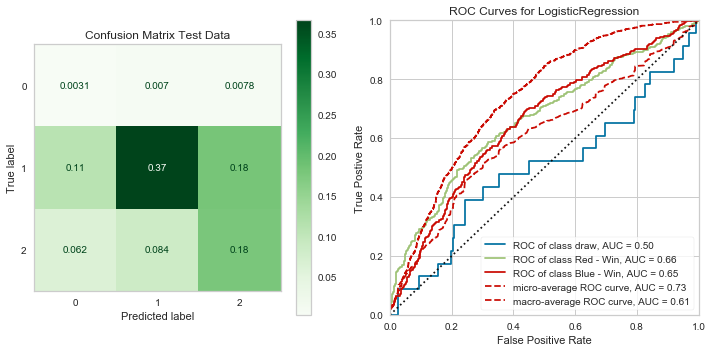


    ---- Timer stopped at: 04/27/2020 - 08:43 PM ----
    ---- Time elasped: 0:00:01.132971 ----
    


    DecisionTreeClassifier(ccp_alpha=0.0, class_weight='balanced', criterion='gini',
                           max_depth=None, max_features=None, max_leaf_nodes=None,
                           min_impurity_decrease=0.0, min_impurity_split=None,
                           min_samples_leaf=1, min_samples_split=2,
                           min_weight_fraction_leaf=0.0, presort='deprecated',
                           random_state=None, splitter='best')


    Classification Report Test
                  precision    recall  f1-score   support
    
               0       0.00      0.00      0.00        23
               1       0.68      0.70      0.69       845
               2       0.38      0.36      0.37       418
    
        accuracy                           0.58      1286
       macro avg       0.36      0.36      0.36      1286
    weighted avg       0.57      0.58      0.58      1286
    
    


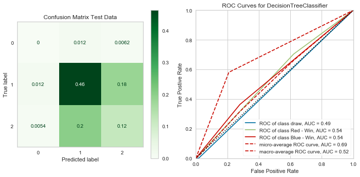


    ---- Timer stopped at: 04/27/2020 - 08:43 PM ----
    ---- Time elasped: 0:00:01.170899 ----
    


    RandomForestClassifier(bootstrap=True, ccp_alpha=0.0, class_weight='balanced',
                           criterion='gini', max_depth=None, max_features='auto',
                           max_leaf_nodes=None, max_samples=None,
                           min_impurity_decrease=0.0, min_impurity_split=None,
                           min_samples_leaf=1, min_samples_split=2,
                           min_weight_fraction_leaf=0.0, n_estimators=100,
                           n_jobs=None, oob_score=False, random_state=None,
                           verbose=0, warm_start=False)


    Classification Report Test
                  precision    recall  f1-score   support
    
               0       0.00      0.00      0.00        23
               1       0.67      0.97      0.79       845
               2       0.60      0.09      0.16       418
    
        accuracy                           0.67      1286
       macro avg       0.42      0.35      0.32      1286
    weighted avg       0.64      0.67      0.57      1286
    
    


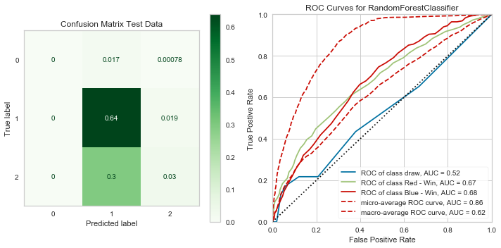


    ---- Timer stopped at: 04/27/2020 - 08:43 PM ----
    ---- Time elasped: 0:00:03.938470 ----
    


    KNeighborsClassifier(algorithm='auto', leaf_size=30, metric='minkowski',
                         metric_params=None, n_jobs=None, n_neighbors=5, p=2,
                         weights='uniform')


    Classification Report Test
                  precision    recall  f1-score   support
    
               0       0.00      0.00      0.00        23
               1       0.68      0.82      0.74       845
               2       0.41      0.26      0.32       418
    
        accuracy                           0.62      1286
       macro avg       0.36      0.36      0.35      1286
    weighted avg       0.58      0.62      0.59      1286
    
    


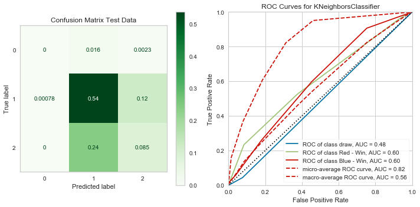


    ---- Timer stopped at: 04/27/2020 - 08:43 PM ----
    ---- Time elasped: 0:00:19.038378 ----
    


    AdaBoostClassifier(algorithm='SAMME.R', base_estimator=None, learning_rate=1.0,
                       n_estimators=50, random_state=None)


    Classification Report Test
                  precision    recall  f1-score   support
    
               0       0.00      0.00      0.00        23
               1       0.68      0.92      0.78       845
               2       0.51      0.18      0.26       418
    
        accuracy                           0.66      1286
       macro avg       0.40      0.36      0.35      1286
    weighted avg       0.61      0.66      0.60      1286
    
    


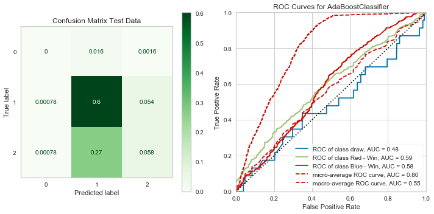


    ---- Timer stopped at: 04/27/2020 - 08:43 PM ----
    ---- Time elasped: 0:00:02.523258 ----
    


    GradientBoostingClassifier(ccp_alpha=0.0, criterion='friedman_mse', init=None,
                               learning_rate=0.1, loss='deviance', max_depth=3,
                               max_features=None, max_leaf_nodes=None,
                               min_impurity_decrease=0.0, min_impurity_split=None,
                               min_samples_leaf=1, min_samples_split=2,
                               min_weight_fraction_leaf=0.0, n_estimators=100,
                               n_iter_no_change=None, presort='deprecated',
                               random_state=None, subsample=1.0, tol=0.0001,
                               validation_fraction=0.1, verbose=0,
                               warm_start=False)


    Classification Report Test
                  precision    recall  f1-score   support
    
               0       0.00      0.00      0.00        23
               1       0.69      0.91      0.79       845
               2       0.54      0.22      0.32       418
    
        accuracy                           0.67      1286
       macro avg       0.41      0.38      0.37      1286
    weighted avg       0.63      0.67      0.62      1286
    
    


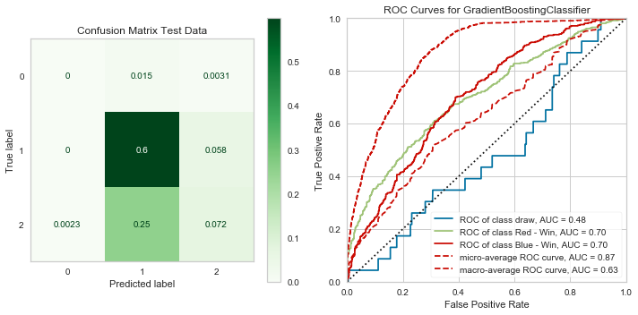


    ---- Timer stopped at: 04/27/2020 - 08:44 PM ----
    ---- Time elasped: 0:00:26.651734 ----
    


    XGBClassifier(base_score=0.5, booster='gbtree', colsample_bylevel=1,
                  colsample_bytree=1, gamma=0, learning_rate=0.1, max_delta_step=0,
                  max_depth=3, min_child_weight=1, missing=None, n_estimators=100,
                  n_jobs=1, nthread=None, num_class=3, objective='multi:softprob',
                  random_state=0, reg_alpha=0, reg_lambda=1, scale_pos_weight=1,
                  seed=None, silent=True, subsample=1)


    Classification Report Test
                  precision    recall  f1-score   support
    
               0       0.00      0.00      0.00        23
               1       0.69      0.92      0.79       845
               2       0.55      0.21      0.31       418
    
        accuracy                           0.67      1286
       macro avg       0.41      0.38      0.36      1286
    weighted avg       0.63      0.67      0.62      1286
    
    


    ---- Timer stopped at: 04/27/2020 - 08:44 PM ----
    ---- Time elasped: 0:00:07.353348 ----
    


```python
# Check for run-times

times_sorted = sorted(times.items(), key=lambda x: x[1])
times_sorted
```


    [('log_clf', 1.132971),
     ('tree_clf', 1.170899),
     ('ada_clf', 2.523258),
     ('rf_clf', 3.93847),
     ('xgb_clf', 7.353348),
     ('knn_clf', 19.038378),
     ('grad_clf', 26.651734)]


> I have good accuracy, but it is misleading because it is almost always guessing class 1, which due to class imbalances is likely to be right when it does. Next I will try and remedy this.

#### SMOTE

> My classifiers may be missing so much due to the class imbalances for the categories, I am going to oversample the minority classes in order to compensate. 


```python
print('Original class distribution: \n')
print(y_train.value_counts())

smote = SMOTE()
X_trn_sca_resmp, y_trn_resmp = smote.fit_sample(X_train_sca, y_train)
X_trn_sca_resmp = pd.DataFrame(X_trn_sca_resmp, columns=X_train_sca.columns)

print('-----------------------------------------')
print('Resampled class distribution: \n')
print(pd.Series(y_trn_resmp).value_counts()) 
```

    Original class distribution: 
    
    1    2625
    2    1173
    0      60
    Name: Winner, dtype: int64
    -----------------------------------------
    Resampled class distribution: 
    
    2    2625
    1    2625
    0    2625
    dtype: int64
    


```python
## Model check

mods = [log_clf, tree_clf, rf_clf, knn_clf, ada_clf, grad_clf, xgb_clf]
mod_labs = ['log_clf', 'tree_clf', 'rf_clf', 'knn_clf', 'ada_clf', 'grad_clf', 'xgb_clf']
t = dlf.Timer()
labs = ['draw', 'Red - Win', 'Blue - Win']

times = dlf.time_models(X_trn_sca_resmp, X_test_sca, y_trn_resmp, y_test, mods, mod_labs, t, cls_lab=labs)
```


    LogisticRegression(C=1000000000.0, class_weight='balanced', dual=False,
                       fit_intercept=True, intercept_scaling=1, l1_ratio=None,
                       max_iter=100, multi_class='multinomial', n_jobs=None,
                       penalty='l2', random_state=None, solver='lbfgs', tol=0.0001,
                       verbose=0, warm_start=False)


    Classification Report Test
                  precision    recall  f1-score   support
    
               0       0.02      0.17      0.03        23
               1       0.79      0.57      0.66       845
               2       0.48      0.52      0.50       418
    
        accuracy                           0.55      1286
       macro avg       0.43      0.42      0.40      1286
    weighted avg       0.67      0.55      0.60      1286
    
    


    ---- Timer stopped at: 04/27/2020 - 08:46 PM ----
    ---- Time elasped: 0:00:01.187388 ----
    


    DecisionTreeClassifier(ccp_alpha=0.0, class_weight='balanced', criterion='gini',
                           max_depth=None, max_features=None, max_leaf_nodes=None,
                           min_impurity_decrease=0.0, min_impurity_split=None,
                           min_samples_leaf=1, min_samples_split=2,
                           min_weight_fraction_leaf=0.0, presort='deprecated',
                           random_state=None, splitter='best')


    Classification Report Test
                  precision    recall  f1-score   support
    
               0       0.00      0.00      0.00        23
               1       0.69      0.65      0.67       845
               2       0.37      0.40      0.38       418
    
        accuracy                           0.55      1286
       macro avg       0.35      0.35      0.35      1286
    weighted avg       0.57      0.55      0.56      1286
    
    


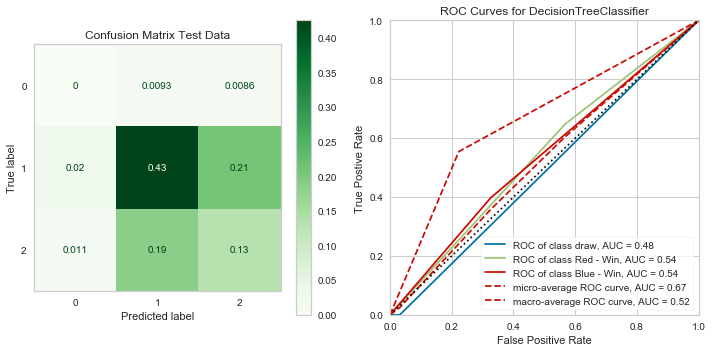


    ---- Timer stopped at: 04/27/2020 - 08:46 PM ----
    ---- Time elasped: 0:00:01.864052 ----
    


    RandomForestClassifier(bootstrap=True, ccp_alpha=0.0, class_weight='balanced',
                           criterion='gini', max_depth=None, max_features='auto',
                           max_leaf_nodes=None, max_samples=None,
                           min_impurity_decrease=0.0, min_impurity_split=None,
                           min_samples_leaf=1, min_samples_split=2,
                           min_weight_fraction_leaf=0.0, n_estimators=100,
                           n_jobs=None, oob_score=False, random_state=None,
                           verbose=0, warm_start=False)


    Classification Report Test
                  precision    recall  f1-score   support
    
               0       0.00      0.00      0.00        23
               1       0.72      0.79      0.76       845
               2       0.50      0.42      0.46       418
    
        accuracy                           0.66      1286
       macro avg       0.41      0.41      0.40      1286
    weighted avg       0.64      0.66      0.64      1286
    
    


    ---- Timer stopped at: 04/27/2020 - 08:47 PM ----
    ---- Time elasped: 0:00:06.475685 ----
    


    KNeighborsClassifier(algorithm='auto', leaf_size=30, metric='minkowski',
                         metric_params=None, n_jobs=None, n_neighbors=5, p=2,
                         weights='uniform')


    Classification Report Test
                  precision    recall  f1-score   support
    
               0       0.01      0.04      0.01        23
               1       0.76      0.43      0.55       845
               2       0.39      0.65      0.48       418
    
        accuracy                           0.49      1286
       macro avg       0.38      0.37      0.35      1286
    weighted avg       0.62      0.49      0.52      1286
    
    


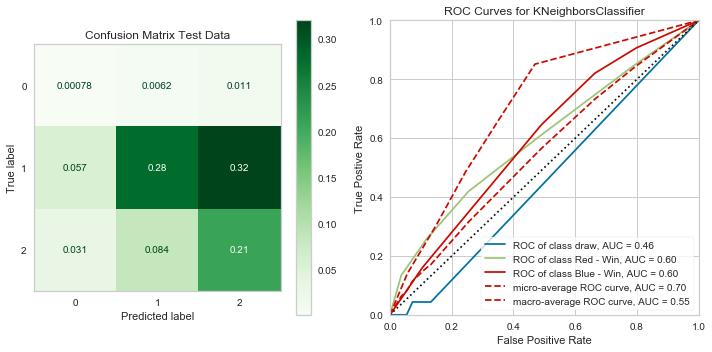


    ---- Timer stopped at: 04/27/2020 - 08:47 PM ----
    ---- Time elasped: 0:00:42.575127 ----
    


    AdaBoostClassifier(algorithm='SAMME.R', base_estimator=None, learning_rate=1.0,
                       n_estimators=50, random_state=None)


    Classification Report Test
                  precision    recall  f1-score   support
    
               0       0.00      0.00      0.00        23
               1       0.71      0.69      0.70       845
               2       0.42      0.45      0.43       418
    
        accuracy                           0.60      1286
       macro avg       0.38      0.38      0.38      1286
    weighted avg       0.60      0.60      0.60      1286
    
    


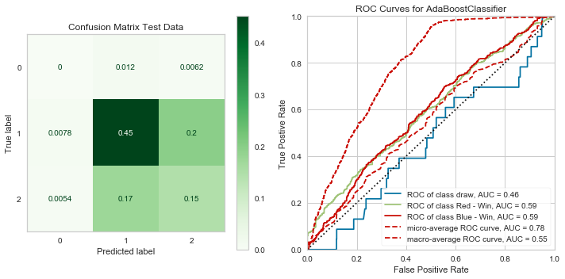


    ---- Timer stopped at: 04/27/2020 - 08:47 PM ----
    ---- Time elasped: 0:00:06.952451 ----
    


    GradientBoostingClassifier(ccp_alpha=0.0, criterion='friedman_mse', init=None,
                               learning_rate=0.1, loss='deviance', max_depth=3,
                               max_features=None, max_leaf_nodes=None,
                               min_impurity_decrease=0.0, min_impurity_split=None,
                               min_samples_leaf=1, min_samples_split=2,
                               min_weight_fraction_leaf=0.0, n_estimators=100,
                               n_iter_no_change=None, presort='deprecated',
                               random_state=None, subsample=1.0, tol=0.0001,
                               validation_fraction=0.1, verbose=0,
                               warm_start=False)


    Classification Report Test
                  precision    recall  f1-score   support
    
               0       0.00      0.00      0.00        23
               1       0.71      0.82      0.76       845
               2       0.48      0.35      0.40       418
    
        accuracy                           0.65      1286
       macro avg       0.39      0.39      0.39      1286
    weighted avg       0.62      0.65      0.63      1286
    
    


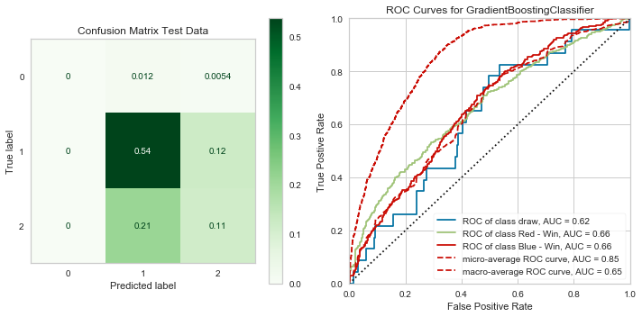


    ---- Timer stopped at: 04/27/2020 - 08:49 PM ----
    ---- Time elasped: 0:01:23.861824 ----
    


    XGBClassifier(base_score=0.5, booster='gbtree', colsample_bylevel=1,
                  colsample_bytree=1, gamma=0, learning_rate=0.1, max_delta_step=0,
                  max_depth=3, min_child_weight=1, missing=None, n_estimators=100,
                  n_jobs=1, nthread=None, num_class=3, objective='multi:softprob',
                  random_state=0, reg_alpha=0, reg_lambda=1, scale_pos_weight=1,
                  seed=None, silent=True, subsample=1)


    Classification Report Test
                  precision    recall  f1-score   support
    
               0       0.00      0.00      0.00        23
               1       0.70      0.81      0.75       845
               2       0.47      0.35      0.40       418
    
        accuracy                           0.65      1286
       macro avg       0.39      0.39      0.39      1286
    weighted avg       0.62      0.65      0.63      1286
    
    


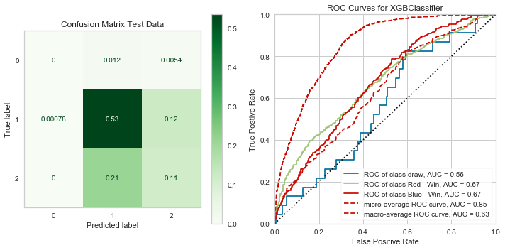


    ---- Timer stopped at: 04/27/2020 - 08:49 PM ----
    ---- Time elasped: 0:00:16.089930 ----
    


```python
times_sorted = sorted(times.items(), key=lambda x: x[1])
times_sorted
```


    [('log_clf', 1.187388),
     ('tree_clf', 1.864052),
     ('rf_clf', 6.475685),
     ('ada_clf', 6.952451),
     ('xgb_clf', 16.08993),
     ('knn_clf', 42.575127),
     ('grad_clf', 83.861824)]


> Model decisions:
* __Keep__: XGB, RandForest 
* __Drop__: GradBoost, AdaBoost, KNN, DecisionTree, Logistic

> Why?:
* Either the time is too long to be worth the effort or the vanilla results netted an accuracy too close to random chance according to the accuracy and weighted/macro averages in the classifcation report. Given these two metrics, I have decided to keep on with the XGB and RandomForest classifiers for parameter tuning.

### Tuning Models


```python
# To be tuned: max_depth (3), n_estimators (100), learning_rate (0.1)

xgb_clf = xgb.XGBClassifier(objective='multi:softprob', num_class=3)

xgb_params = {'max_depth': [2, 5],
              'n_estimators': [115, 130],
              'learning_rate': [0.05, 0.2]}

xgb_gridsrch = GridSearchCV(xgb_clf, xgb_params, cv=3, return_train_score=True)

t2 = dlf.Timer()
```


```python
t2.start()
xgb_gridsrch.fit(X_trn_sca_resmp, y_trn_resmp)
t2.stop()
```

    ---- Timer stopped at: 04/27/2020 - 08:56 PM ----
    ---- Time elasped: 0:06:12.367633 ----
    


```python
xgb_tr_score = np.mean(xgb_gridsrch.cv_results_['mean_train_score'])
xgb_te_score = xgb_gridsrch.score(X_test_sca, y_test)

print(f"Mean Training Score: {xgb_tr_score :.2%}")
print(f"Mean Test Score: {xgb_te_score :.2%}")
print("Best Parameter Combination Found During Grid Search:")
xgb_gridsrch.best_params_
```

    Mean Training Score: 89.22%
    Mean Test Score: 65.63%
    Best Parameter Combination Found During Grid Search:
    


    {'learning_rate': 0.2, 'max_depth': 5, 'n_estimators': 115}


```python
# To be tuned: max_depth (None), n_estimators (100), max_features ('auto'), criterion ('gini') 

rf_clf = RandomForestClassifier(class_weight='balanced')

rf_params = {'criterion': ['gini', 'entropy'],
             'max_depth': [3, 7],
             'n_estimators': [115, 125],
             'max_features': [0.5, 0.8]}

rf_gridsrch = GridSearchCV(rf_clf, rf_params, cv=3, return_train_score=True)

t3 = dlf.Timer()
```


```python
t3.start()
rf_gridsrch.fit(X_trn_sca_resmp, y_trn_resmp)
t3.stop()
```

    ---- Timer stopped at: 04/27/2020 - 09:15 PM ----
    ---- Time elasped: 0:15:35.718703 ----
    


```python
rf_tr_score = np.mean(rf_gridsrch.cv_results_['mean_train_score'])
rf_te_score = rf_gridsrch.score(X_test_sca, y_test)

print(f"Mean Training Score: {rf_tr_score :.2%}")
print(f"Mean Test Score: {rf_te_score :.2%}")
print("Best Parameter Combination Found During Grid Search:")
rf_gridsrch.best_params_
```

    Mean Training Score: 71.79%
    Mean Test Score: 61.43%
    Best Parameter Combination Found During Grid Search:
    


    {'criterion': 'gini', 'max_depth': 7, 'max_features': 0.5, 'n_estimators': 125}


> Now I will be moving forward with the XGB Classifier for now, 4 points is enough for me to stick with this estimator, however, if I do want to revisit this problem I will check on the results of a random forest as well. I will try some more tuning of the same parameters to try and get higher than 66%, which was the same accuracy of the vanilla model.


```python
#xgb_params2 = {'max_depth': [4, 7],
#              'n_estimators': [150, 175],
#              'learning_rate': [0.15, 0.25]}
#
#xgb_gridsrch2 = grid_searcher(xgb_clf, xgb_params2, X_trn_sca_resmp, X_test_sca,
#                              y_trn_resmp, y_test, cv=3)
```


```python
#xgb_params3 = {'max_depth': [1, 2, 3],
#              'n_estimators': [90, 140],
#              'learning_rate': [0.125, 0.175]}
#
#xgb_gridsrch3 = grid_searcher(xgb_clf, xgb_params3, X_trn_sca_resmp, X_test_sca,
#                              y_trn_resmp, y_test, cv=3)
```


```python
#xgb_params4 = {'max_depth': [3, 4],
#              'n_estimators': [100, 120],
#              'learning_rate': [0.15, 0.175]}
#
#xgb_gridsrch4 = grid_searcher(xgb_clf, xgb_params4, X_trn_sca_resmp, X_test_sca,
#                              y_trn_resmp, y_test, cv=3)
```


```python
#xgb_params5 = {'max_depth': [4, 5],
#              'n_estimators': [120, 110],
#              'learning_rate': [0.1, 0.175, 0.2]}
#
#xgb_gridsrch5 = grid_searcher(xgb_clf, xgb_params5, X_trn_sca_resmp, X_test_sca,
#                              y_trn_resmp, y_test, cv=3)
```


```python
#xgb_params6 = {'max_depth': [2],
#              'n_estimators': [90, 100],
#              'learning_rate': [0.05, 0.01]}
#
#xgb_gridsrch6 = grid_searcher(xgb_clf, xgb_params6, X_trn_sca_resmp, X_test_sca,
#                              y_trn_resmp, y_test, cv=3)
```


```python
#xgb_params7 = {'max_depth': [1],
#              'n_estimators': [100, 110],
#              'learning_rate': [0.05, 0.1]}
#
#xgb_gridsrch7 = grid_searcher(xgb_clf, xgb_params7, X_trn_sca_resmp, X_test_sca,
#                              y_trn_resmp, y_test, cv=3)
```


```python
xgb_params8 = {'max_depth': [1],
              'n_estimators': [200],
              'learning_rate': [0.05, 0.1]}

xgb_gridsrch8 = dlf.grid_searcher(xgb_clf, xgb_params8, X_trn_sca_resmp, X_test_sca,
                              y_trn_resmp, y_test, cv=3)
```

    ---- Timer stopped at: 04/27/2020 - 09:17 PM ----
    ---- Time elasped: 0:00:53.056722 ----
    Mean Training Score: 70.03%
    Mean Test Score: 59.49%
    Best Parameters:
    {'learning_rate': 0.1, 'max_depth': 1, 'n_estimators': 200}
    


```python
xgb_params9 = {'max_depth': [2],
              'n_estimators': [50],
              'learning_rate': [0.2]}

xgb_gridsrch9 = dlf.grid_searcher(xgb_clf, xgb_params9, X_trn_sca_resmp, X_test_sca,
                              y_trn_resmp, y_test, cv=3)
```

    ---- Timer stopped at: 04/27/2020 - 09:18 PM ----
    ---- Time elasped: 0:00:13.313452 ----
    Mean Training Score: 81.26%
    Mean Test Score: 64.93%
    Best Parameters:
    {'learning_rate': 0.2, 'max_depth': 2, 'n_estimators': 50}
    

### Creating Final-*ish* Model

> I will go with the closest of the two scores to stay away from models that are overfit. These are:

* max_depth: 2
* learning_rate: 0.05
* n_estimators: 50


```python
xgb_fin = xgb.XGBClassifier(max_depth=2, learning_rate=0.05, n_estimators=50, 
                            objective='multi:softprob', num_class=3)
```


```python
t_fin = dlf.Timer()
labs = ['Draw', 'Red - Win', 'Blue - Win']

time_fin = dlf.time_models(X_trn_sca_resmp, X_test_sca, y_trn_resmp, y_test, [xgb_fin], ['XGB Final'], t_fin, cls_lab=labs)
```


    XGBClassifier(base_score=0.5, booster='gbtree', colsample_bylevel=1,
                  colsample_bytree=1, gamma=0, learning_rate=0.05, max_delta_step=0,
                  max_depth=2, min_child_weight=1, missing=None, n_estimators=50,
                  n_jobs=1, nthread=None, num_class=3, objective='multi:softprob',
                  random_state=0, reg_alpha=0, reg_lambda=1, scale_pos_weight=1,
                  seed=None, silent=True, subsample=1)


    Classification Report Test
                  precision    recall  f1-score   support
    
               0       0.02      0.09      0.04        23
               1       0.72      0.71      0.71       845
               2       0.46      0.41      0.44       418
    
        accuracy                           0.60      1286
       macro avg       0.40      0.40      0.40      1286
    weighted avg       0.63      0.60      0.61      1286
    
    


    ---- Timer stopped at: 04/27/2020 - 09:18 PM ----
    ---- Time elasped: 0:00:05.664888 ----
    

> Not *entirely* what I expected. But it is clear that my model is failing to predict class 0 (Draw outcome). I am going to try my hand at a binary classification.

### Re-evaluation of data


```python
## Starting over and resetting target to only include fights with a winner

dummy_binary = pd.get_dummies(cat_df)
dummy_binary.drop(columns=['title_bout', 'Winner_Red'], inplace=True)

draws = dummy_binary[dummy_binary['Winner_Draw'] == 1].index
dummy_binary.drop(columns='Winner_Draw', index=draws, inplace=True)

dummy_binary.head()
```


<div>
<style scoped>
    .dataframe tbody tr th:only-of-type {
        vertical-align: middle;
    }

    .dataframe tbody tr th {
        vertical-align: top;
    }

    .dataframe thead th {
        text-align: right;
    }
</style>
<table border="1" class="dataframe">
  <thead>
    <tr style="text-align: right;">
      <th></th>
      <th>Winner_Blue</th>
      <th>weight_class_Bantamweight</th>
      <th>weight_class_Catch Weight</th>
      <th>weight_class_Featherweight</th>
      <th>weight_class_Flyweight</th>
      <th>weight_class_Heavyweight</th>
      <th>weight_class_Light Heavyweight</th>
      <th>weight_class_Lightweight</th>
      <th>weight_class_Middleweight</th>
      <th>weight_class_Open Weight</th>
      <th>...</th>
      <th>B_Stance_Open Stance</th>
      <th>B_Stance_Orthodox</th>
      <th>B_Stance_Sideways</th>
      <th>B_Stance_Southpaw</th>
      <th>B_Stance_Switch</th>
      <th>R_Stance_Open Stance</th>
      <th>R_Stance_Orthodox</th>
      <th>R_Stance_Sideways</th>
      <th>R_Stance_Southpaw</th>
      <th>R_Stance_Switch</th>
    </tr>
  </thead>
  <tbody>
    <tr>
      <th>0</th>
      <td>0</td>
      <td>1</td>
      <td>0</td>
      <td>0</td>
      <td>0</td>
      <td>0</td>
      <td>0</td>
      <td>0</td>
      <td>0</td>
      <td>0</td>
      <td>...</td>
      <td>0</td>
      <td>1</td>
      <td>0</td>
      <td>0</td>
      <td>0</td>
      <td>0</td>
      <td>1</td>
      <td>0</td>
      <td>0</td>
      <td>0</td>
    </tr>
    <tr>
      <th>1</th>
      <td>0</td>
      <td>0</td>
      <td>0</td>
      <td>0</td>
      <td>0</td>
      <td>0</td>
      <td>0</td>
      <td>0</td>
      <td>0</td>
      <td>0</td>
      <td>...</td>
      <td>0</td>
      <td>1</td>
      <td>0</td>
      <td>0</td>
      <td>0</td>
      <td>0</td>
      <td>0</td>
      <td>0</td>
      <td>1</td>
      <td>0</td>
    </tr>
    <tr>
      <th>2</th>
      <td>0</td>
      <td>0</td>
      <td>0</td>
      <td>0</td>
      <td>0</td>
      <td>0</td>
      <td>0</td>
      <td>1</td>
      <td>0</td>
      <td>0</td>
      <td>...</td>
      <td>0</td>
      <td>1</td>
      <td>0</td>
      <td>0</td>
      <td>0</td>
      <td>0</td>
      <td>1</td>
      <td>0</td>
      <td>0</td>
      <td>0</td>
    </tr>
    <tr>
      <th>3</th>
      <td>1</td>
      <td>1</td>
      <td>0</td>
      <td>0</td>
      <td>0</td>
      <td>0</td>
      <td>0</td>
      <td>0</td>
      <td>0</td>
      <td>0</td>
      <td>...</td>
      <td>0</td>
      <td>0</td>
      <td>0</td>
      <td>0</td>
      <td>1</td>
      <td>0</td>
      <td>1</td>
      <td>0</td>
      <td>0</td>
      <td>0</td>
    </tr>
    <tr>
      <th>4</th>
      <td>1</td>
      <td>0</td>
      <td>0</td>
      <td>0</td>
      <td>0</td>
      <td>1</td>
      <td>0</td>
      <td>0</td>
      <td>0</td>
      <td>0</td>
      <td>...</td>
      <td>0</td>
      <td>0</td>
      <td>0</td>
      <td>1</td>
      <td>0</td>
      <td>0</td>
      <td>0</td>
      <td>0</td>
      <td>1</td>
      <td>0</td>
    </tr>
  </tbody>
</table>
<p>5 rows × 25 columns</p>
</div>


```python
## Putting it all together again

df_full_binary = pd.concat([df_fill.drop(columns=drop_cols), win_series, title_series], axis=1).copy()
```


```python
df_full_binary.drop(index=draws, inplace=True)
df_full_binary = pd.concat([df_full_binary, dummy_binary], axis=1)
#df_full_binary.head()
```

#### Re-prep for model


```python
## Train-test split

y_bin = df_full_binary['Winner_Blue'].copy()
X_bin = df_full_binary.drop(['Winner_Blue', 'Winner'], axis=1).copy()

X_train_bin, X_test_bin, y_train_bin, y_test_bin = train_test_split(X_bin, y_bin)
```


```python
print('Original Class Balance')
display(y_bin.value_counts(normalize=True))
print('y_train Class Balance')
display(y_train_bin.value_counts(normalize=True))
print('y_test Class Balance')
display(y_test_bin.value_counts(normalize=True))
```

    Original Class Balance
    


    0    0.685635
    1    0.314365
    Name: Winner_Blue, dtype: float64


    y_train Class Balance
    


    0    0.690382
    1    0.309618
    Name: Winner_Blue, dtype: float64


    y_test Class Balance
    


    0    0.671406
    1    0.328594
    Name: Winner_Blue, dtype: float64


```python
## Min max scale to help with varying values

scaler_bin = MinMaxScaler()

X_train_sca_bin = pd.DataFrame(scaler.fit_transform(X_train_bin), columns=X_train_bin.columns,
                           index=X_train_bin.index)
X_test_sca_bin = pd.DataFrame(scaler.transform(X_test_bin), columns=X_test_bin.columns, 
                          index=X_test_bin.index)
```


```python
## Fix class imbalance

print('Original class distribution: \n')
print(y_train_bin.value_counts())

smote_bin = SMOTE()
X_trn_sca_resmp_bin, y_trn_resmp_bin = smote_bin.fit_sample(X_train_sca_bin, y_train_bin)
X_trn_sca_resmp_bin = pd.DataFrame(X_trn_sca_resmp_bin, columns=X_train_sca_bin.columns)

## Preview resampled class distribution
print('-----------------------------------------')
print('Resampled class distribution: \n')
print(pd.Series(y_trn_resmp_bin).value_counts()) 
```

    Original class distribution: 
    
    0    2620
    1    1175
    Name: Winner_Blue, dtype: int64
    -----------------------------------------
    Resampled class distribution: 
    
    1    2620
    0    2620
    dtype: int64
    

#### Vanilla Check


```python
tree_clf_bin = DecisionTreeClassifier(class_weight='balanced')
rf_clf_bin = RandomForestClassifier(class_weight='balanced')
log_clf_bin = LogisticRegression(C=1e9, class_weight='balanced', solver='liblinear')
knn_clf_bin = KNeighborsClassifier()
ada_clf_bin = AdaBoostClassifier()
grad_clf_bin = GradientBoostingClassifier()
xgb_clf_bin = xgb.XGBClassifier()
```


```python
mods_bin = [log_clf_bin, tree_clf_bin, rf_clf_bin, knn_clf_bin, ada_clf_bin, grad_clf_bin, xgb_clf_bin]
mod_labs_bin = ['log_clf_bin', 'tree_clf_bin', 'rf_clf_bin', 'knn_clf_bin', 'ada_clf_bin', 'grad_clf_bin', 'xgb_clf_bin']
t_bin = dlf.Timer()
labs_bin = ['Red - Win', 'Blue - Win']

times_bin = dlf.time_models(X_train_sca_bin, X_test_sca_bin, y_train_bin, y_test_bin, mods_bin, mod_labs_bin, t_bin, cls_lab=labs_bin)
```


    LogisticRegression(C=1000000000.0, class_weight='balanced', dual=False,
                       fit_intercept=True, intercept_scaling=1, l1_ratio=None,
                       max_iter=100, multi_class='auto', n_jobs=None, penalty='l2',
                       random_state=None, solver='liblinear', tol=0.0001, verbose=0,
                       warm_start=False)


    Classification Report Test
                  precision    recall  f1-score   support
    
               0       0.81      0.69      0.74       850
               1       0.51      0.66      0.58       416
    
        accuracy                           0.68      1266
       macro avg       0.66      0.68      0.66      1266
    weighted avg       0.71      0.68      0.69      1266
    
    


    ---- Timer stopped at: 04/27/2020 - 09:24 PM ----
    ---- Time elasped: 0:00:01.476020 ----
    


    DecisionTreeClassifier(ccp_alpha=0.0, class_weight='balanced', criterion='gini',
                           max_depth=None, max_features=None, max_leaf_nodes=None,
                           min_impurity_decrease=0.0, min_impurity_split=None,
                           min_samples_leaf=1, min_samples_split=2,
                           min_weight_fraction_leaf=0.0, presort='deprecated',
                           random_state=None, splitter='best')


    Classification Report Test
                  precision    recall  f1-score   support
    
               0       0.71      0.70      0.70       850
               1       0.41      0.42      0.41       416
    
        accuracy                           0.61      1266
       macro avg       0.56      0.56      0.56      1266
    weighted avg       0.61      0.61      0.61      1266
    
    


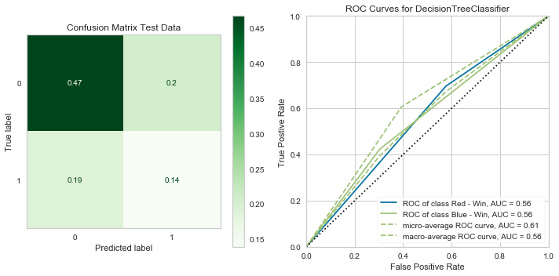


    ---- Timer stopped at: 04/27/2020 - 09:24 PM ----
    ---- Time elasped: 0:00:01.048227 ----
    


    RandomForestClassifier(bootstrap=True, ccp_alpha=0.0, class_weight='balanced',
                           criterion='gini', max_depth=None, max_features='auto',
                           max_leaf_nodes=None, max_samples=None,
                           min_impurity_decrease=0.0, min_impurity_split=None,
                           min_samples_leaf=1, min_samples_split=2,
                           min_weight_fraction_leaf=0.0, n_estimators=100,
                           n_jobs=None, oob_score=False, random_state=None,
                           verbose=0, warm_start=False)


    Classification Report Test
                  precision    recall  f1-score   support
    
               0       0.68      0.93      0.78       850
               1       0.42      0.11      0.17       416
    
        accuracy                           0.66      1266
       macro avg       0.55      0.52      0.48      1266
    weighted avg       0.59      0.66      0.58      1266
    
    


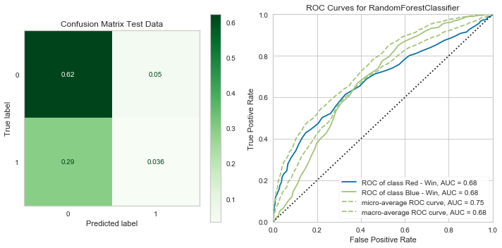


    ---- Timer stopped at: 04/27/2020 - 09:24 PM ----
    ---- Time elasped: 0:00:03.333059 ----
    


    KNeighborsClassifier(algorithm='auto', leaf_size=30, metric='minkowski',
                         metric_params=None, n_jobs=None, n_neighbors=5, p=2,
                         weights='uniform')


    Classification Report Test
                  precision    recall  f1-score   support
    
               0       0.70      0.78      0.74       850
               1       0.41      0.32      0.36       416
    
        accuracy                           0.63      1266
       macro avg       0.56      0.55      0.55      1266
    weighted avg       0.60      0.63      0.61      1266
    
    


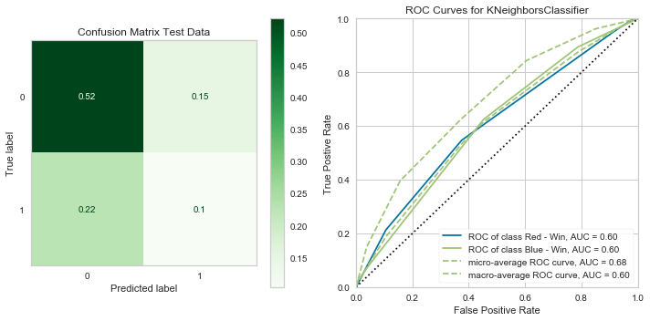


    ---- Timer stopped at: 04/27/2020 - 09:24 PM ----
    ---- Time elasped: 0:00:12.550474 ----
    


    AdaBoostClassifier(algorithm='SAMME.R', base_estimator=None, learning_rate=1.0,
                       n_estimators=50, random_state=None)


    Classification Report Test
                  precision    recall  f1-score   support
    
               0       0.72      0.88      0.79       850
               1       0.54      0.30      0.38       416
    
        accuracy                           0.69      1266
       macro avg       0.63      0.59      0.59      1266
    weighted avg       0.66      0.69      0.66      1266
    
    


    ---- Timer stopped at: 04/27/2020 - 09:24 PM ----
    ---- Time elasped: 0:00:02.401591 ----
    


    GradientBoostingClassifier(ccp_alpha=0.0, criterion='friedman_mse', init=None,
                               learning_rate=0.1, loss='deviance', max_depth=3,
                               max_features=None, max_leaf_nodes=None,
                               min_impurity_decrease=0.0, min_impurity_split=None,
                               min_samples_leaf=1, min_samples_split=2,
                               min_weight_fraction_leaf=0.0, n_estimators=100,
                               n_iter_no_change=None, presort='deprecated',
                               random_state=None, subsample=1.0, tol=0.0001,
                               validation_fraction=0.1, verbose=0,
                               warm_start=False)


    Classification Report Test
                  precision    recall  f1-score   support
    
               0       0.71      0.91      0.80       850
               1       0.57      0.24      0.33       416
    
        accuracy                           0.69      1266
       macro avg       0.64      0.57      0.57      1266
    weighted avg       0.66      0.69      0.65      1266
    
    


    ---- Timer stopped at: 04/27/2020 - 09:24 PM ----
    ---- Time elasped: 0:00:07.875940 ----
    


    XGBClassifier(base_score=0.5, booster='gbtree', colsample_bylevel=1,
                  colsample_bytree=1, gamma=0, learning_rate=0.1, max_delta_step=0,
                  max_depth=3, min_child_weight=1, missing=None, n_estimators=100,
                  n_jobs=1, nthread=None, objective='binary:logistic',
                  random_state=0, reg_alpha=0, reg_lambda=1, scale_pos_weight=1,
                  seed=None, silent=True, subsample=1)


    Classification Report Test
                  precision    recall  f1-score   support
    
               0       0.71      0.91      0.80       850
               1       0.56      0.23      0.32       416
    
        accuracy                           0.69      1266
       macro avg       0.63      0.57      0.56      1266
    weighted avg       0.66      0.69      0.64      1266
    
    


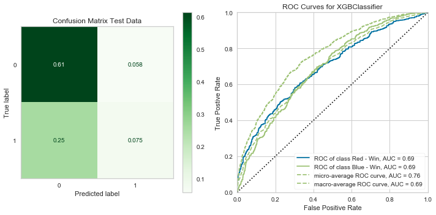


    ---- Timer stopped at: 04/27/2020 - 09:24 PM ----
    ---- Time elasped: 0:00:02.666879 ----
    

> Pretty similar results to the multi-class models, hopefully running some grid searches will help.

#### Re-tune


```python
## For reference

#rf_clf_bin = RandomForestClassifier(class_weight='balanced')
#tree_clf_bin = DecisionTreeClassifier(class_weight='balanced')
```


```python
tree_params_bin = {'criterion': ['gini', 'entropy'],
                 'min_samples_leaf': [3],
                 'max_depth': [10],
                 'max_features': [0.8, 0.5]}

tree_gridsrch_bin = dlf.grid_searcher(tree_clf_bin, tree_params_bin, X_trn_sca_resmp_bin,
                                 X_test_sca_bin, y_trn_resmp_bin, y_test_bin, cv=3)
```

    ---- Timer stopped at: 04/27/2020 - 09:27 PM ----
    ---- Time elasped: 0:00:03.375974 ----
    Mean Training Score: 85.28%
    Mean Test Score: 60.43%
    Best Parameters:
    {'criterion': 'entropy', 'max_depth': 10, 'max_features': 0.8, 'min_samples_leaf': 3}
    


```python
log_params_bin = {'C': [1e12, 1e5, 1e2, 1],
                  'solver': ['liblinear', 'saga']}

log_gridsrch_bin = dlf.grid_searcher(log_clf_bin, log_params_bin, X_trn_sca_resmp_bin,
                                 X_test_sca_bin, y_trn_resmp_bin, y_test_bin, cv=3)
```

    ---- Timer stopped at: 04/27/2020 - 09:28 PM ----
    ---- Time elasped: 0:00:16.271521 ----
    Mean Training Score: 70.18%
    Mean Test Score: 67.69%
    Best Parameters:
    {'C': 100.0, 'solver': 'liblinear'}
    


```python
log_params_bin2 = {'C': [1],
                  'solver': ['liblinear']}

log_gridsrch_bin2 = dlf.grid_searcher(log_clf_bin, log_params_bin2, X_trn_sca_resmp_bin,
                                 X_test_sca_bin, y_trn_resmp_bin, y_test_bin, cv=3)
```

    ---- Timer stopped at: 04/27/2020 - 09:28 PM ----
    ---- Time elasped: 0:00:00.531575 ----
    Mean Training Score: 69.73%
    Mean Test Score: 66.19%
    Best Parameters:
    {'C': 1, 'solver': 'liblinear'}
    


```python
log_clf_bin_fin = LogisticRegression(C=1, class_weight='balanced', solver='liblinear')

mods_bin_fin = [log_clf_bin_fin]
mod_labs_bin_fin = ['log_clf_bin_fin']
t_bin_fin = dlf.Timer()

times_bin_fin = dlf.time_models(X_train_sca_bin, X_test_sca_bin, y_train_bin, y_test_bin, mods_bin_fin, mod_labs_bin_fin, t_bin_fin, cls_lab=labs_bin)
```


    LogisticRegression(C=1, class_weight='balanced', dual=False, fit_intercept=True,
                       intercept_scaling=1, l1_ratio=None, max_iter=100,
                       multi_class='auto', n_jobs=None, penalty='l2',
                       random_state=None, solver='liblinear', tol=0.0001, verbose=0,
                       warm_start=False)


    Classification Report Test
                  precision    recall  f1-score   support
    
               0       0.79      0.68      0.73       850
               1       0.49      0.63      0.55       416
    
        accuracy                           0.66      1266
       macro avg       0.64      0.66      0.64      1266
    weighted avg       0.69      0.66      0.67      1266
    
    


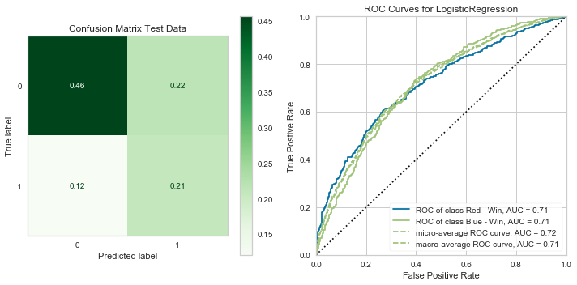


    ---- Timer stopped at: 04/27/2020 - 09:29 PM ----
    ---- Time elasped: 0:00:00.712094 ----
    

> By using the logistic regression model and re-formatting the problem I was able to get an overall accuracy of 66%. Although not much better, I prefer this one due to the number of true positives it was able to generate comparatively.

### Re-evaluation 2.0

> My thoughts now are that maybe the use of fighters without a history could be holding my model back, because it is making a guess about something without a value in many of the possible attributes.

#### Filling NAs


```python
print(df.shape)
print(df_full_binary.shape)
```

    (5144, 140)
    (5061, 162)
    

> Here I dropped all of those avgs I filled previously


```python
## Create a copy of the master and drop all of the rows with non-experienced
## fighters

df_fill_bin = df.copy()
df_fill_bin.dropna(subset=zero_fill_cols, inplace=True)
```


```python
## Quick helper to minimize code length

df_fill_bin = dlf.NA_handler_bin(df_fill_bin);
```

    Stance Distributions:
    Orthodox       0.763011
    Southpaw       0.202574
    Switch         0.032457
    Open Stance    0.001399
    Sideways       0.000560
    Name: B_Stance, dtype: float64 
    
    Orthodox       0.754479
    Southpaw       0.214166
    Switch         0.027996
    Open Stance    0.003359
    Name: R_Stance, dtype: float64
    
    Stances:
    ['Orthodox', 'Switch', 'Southpaw', 'Open Stance', 'Sideways'] 
    
    Stance Probabilities:
    [7.63010632e-01 2.02574147e-01 3.24566312e-02 1.39899273e-03
     5.59597090e-04] 
    
    Null Values Remaining:
    


    4800   NaN
    4814   NaN
    Name: R_Reach_cms, dtype: float64


    4800   NaN
    4814   NaN
    Name: B_Reach_cms, dtype: float64


    Age Mean:
    B_age    29.649220
    R_age    29.940319
    dtype: float64 
    
    Midpoint Age Mean:
    29.79476976094046
    


    <matplotlib.axes._subplots.AxesSubplot at 0x15474441828>


#### Endcoding Categoricals


```python
cat_df_bin_skim = df_fill_bin.select_dtypes(['object', 'bool']).copy()

dummy_binary_skim = pd.get_dummies(cat_df_bin_skim)
dummy_binary_skim.drop(columns=['title_bout', 'Winner_Red'], inplace=True)

draws_skim = dummy_binary_skim[dummy_binary_skim['Winner_Draw'] == 1].index
dummy_binary_skim.drop(columns='Winner_Draw', index=draws_skim, inplace=True)
print('Dummy Df columns:')
print(dummy_binary_skim.columns, '\n')

title_series_skim = cat_df_bin_skim['title_bout'].copy()
title_series_skim = title_series_skim.map(dict_title)
print('Title Bout Values:')
display(title_series_skim.head())
```

    Dummy Df columns:
    Index(['Winner_Blue', 'weight_class_Bantamweight', 'weight_class_Catch Weight',
           'weight_class_Featherweight', 'weight_class_Flyweight',
           'weight_class_Heavyweight', 'weight_class_Light Heavyweight',
           'weight_class_Lightweight', 'weight_class_Middleweight',
           'weight_class_Open Weight', 'weight_class_Welterweight',
           'weight_class_Women's Bantamweight',
           'weight_class_Women's Featherweight', 'weight_class_Women's Flyweight',
           'weight_class_Women's Strawweight', 'B_Stance_Open Stance',
           'B_Stance_Orthodox', 'B_Stance_Sideways', 'B_Stance_Southpaw',
           'B_Stance_Switch', 'R_Stance_Open Stance', 'R_Stance_Orthodox',
           'R_Stance_Southpaw', 'R_Stance_Switch'],
          dtype='object') 
    
    Title Bout Values:
    


    0    1
    1    1
    2    0
    3    0
    4    0
    Name: title_bout, dtype: int64


```python
df_skim_binary = pd.concat([df_fill_bin.drop(columns=drop_cols), title_series_skim], axis=1).copy()
```


```python
df_skim_binary.drop(index=draws_skim, inplace=True)
df_skim_binary = pd.concat([df_skim_binary, dummy_binary_skim], axis=1)
print(df_skim_binary.shape)
df_skim_binary.head()
```

    (3592, 160)
    


<div>
<style scoped>
    .dataframe tbody tr th:only-of-type {
        vertical-align: middle;
    }

    .dataframe tbody tr th {
        vertical-align: top;
    }

    .dataframe thead th {
        text-align: right;
    }
</style>
<table border="1" class="dataframe">
  <thead>
    <tr style="text-align: right;">
      <th></th>
      <th>no_of_rounds</th>
      <th>B_current_lose_streak</th>
      <th>B_current_win_streak</th>
      <th>B_draw</th>
      <th>B_avg_BODY_att</th>
      <th>B_avg_BODY_landed</th>
      <th>B_avg_CLINCH_att</th>
      <th>B_avg_CLINCH_landed</th>
      <th>B_avg_DISTANCE_att</th>
      <th>B_avg_DISTANCE_landed</th>
      <th>...</th>
      <th>weight_class_Women's Strawweight</th>
      <th>B_Stance_Open Stance</th>
      <th>B_Stance_Orthodox</th>
      <th>B_Stance_Sideways</th>
      <th>B_Stance_Southpaw</th>
      <th>B_Stance_Switch</th>
      <th>R_Stance_Open Stance</th>
      <th>R_Stance_Orthodox</th>
      <th>R_Stance_Southpaw</th>
      <th>R_Stance_Switch</th>
    </tr>
  </thead>
  <tbody>
    <tr>
      <th>0</th>
      <td>5</td>
      <td>0.0</td>
      <td>4.0</td>
      <td>0.0</td>
      <td>9.200000</td>
      <td>6.000000</td>
      <td>0.200000</td>
      <td>0.000000</td>
      <td>62.600000</td>
      <td>20.600000</td>
      <td>...</td>
      <td>0</td>
      <td>0</td>
      <td>1</td>
      <td>0</td>
      <td>0</td>
      <td>0</td>
      <td>0</td>
      <td>1</td>
      <td>0</td>
      <td>0</td>
    </tr>
    <tr>
      <th>1</th>
      <td>5</td>
      <td>0.0</td>
      <td>3.0</td>
      <td>0.0</td>
      <td>14.600000</td>
      <td>9.100000</td>
      <td>11.800000</td>
      <td>7.300000</td>
      <td>124.700000</td>
      <td>42.100000</td>
      <td>...</td>
      <td>0</td>
      <td>0</td>
      <td>1</td>
      <td>0</td>
      <td>0</td>
      <td>0</td>
      <td>0</td>
      <td>0</td>
      <td>1</td>
      <td>0</td>
    </tr>
    <tr>
      <th>2</th>
      <td>3</td>
      <td>0.0</td>
      <td>3.0</td>
      <td>0.0</td>
      <td>15.354839</td>
      <td>11.322581</td>
      <td>6.741935</td>
      <td>4.387097</td>
      <td>84.741935</td>
      <td>38.580645</td>
      <td>...</td>
      <td>0</td>
      <td>0</td>
      <td>1</td>
      <td>0</td>
      <td>0</td>
      <td>0</td>
      <td>0</td>
      <td>1</td>
      <td>0</td>
      <td>0</td>
    </tr>
    <tr>
      <th>3</th>
      <td>3</td>
      <td>0.0</td>
      <td>4.0</td>
      <td>0.0</td>
      <td>17.000000</td>
      <td>14.000000</td>
      <td>13.750000</td>
      <td>11.000000</td>
      <td>109.500000</td>
      <td>48.750000</td>
      <td>...</td>
      <td>0</td>
      <td>0</td>
      <td>0</td>
      <td>0</td>
      <td>0</td>
      <td>1</td>
      <td>0</td>
      <td>1</td>
      <td>0</td>
      <td>0</td>
    </tr>
    <tr>
      <th>4</th>
      <td>3</td>
      <td>0.0</td>
      <td>1.0</td>
      <td>0.0</td>
      <td>17.000000</td>
      <td>14.500000</td>
      <td>2.500000</td>
      <td>2.000000</td>
      <td>201.000000</td>
      <td>59.500000</td>
      <td>...</td>
      <td>0</td>
      <td>0</td>
      <td>0</td>
      <td>0</td>
      <td>1</td>
      <td>0</td>
      <td>0</td>
      <td>0</td>
      <td>1</td>
      <td>0</td>
    </tr>
  </tbody>
</table>
<p>5 rows × 160 columns</p>
</div>


#### Re-prep 2.0


```python
y_bin_skim = df_skim_binary['Winner_Blue'].copy()
X_bin_skim = df_skim_binary.drop(['Winner_Blue'], axis=1).copy()

X_train_bin_skim, X_test_bin_skim, y_train_bin_skim, y_test_bin_skim = train_test_split(X_bin_skim, y_bin_skim, test_size=0.2)
```


```python
X_bin_skim.columns
```


    Index(['no_of_rounds', 'B_current_lose_streak', 'B_current_win_streak',
           'B_draw', 'B_avg_BODY_att', 'B_avg_BODY_landed', 'B_avg_CLINCH_att',
           'B_avg_CLINCH_landed', 'B_avg_DISTANCE_att', 'B_avg_DISTANCE_landed',
           ...
           'weight_class_Women's Strawweight', 'B_Stance_Open Stance',
           'B_Stance_Orthodox', 'B_Stance_Sideways', 'B_Stance_Southpaw',
           'B_Stance_Switch', 'R_Stance_Open Stance', 'R_Stance_Orthodox',
           'R_Stance_Southpaw', 'R_Stance_Switch'],
          dtype='object', length=159)


```python
print('Original Class Balance')
display(y_bin_skim.value_counts(normalize=True))
print('y_train Class Balance')
display(y_train_bin_skim.value_counts(normalize=True))
print('y_test Class Balance')
display(y_test_bin_skim.value_counts(normalize=True))
```

    Original Class Balance
    


    0    0.662584
    1    0.337416
    Name: Winner_Blue, dtype: float64


    y_train Class Balance
    


    0    0.669335
    1    0.330665
    Name: Winner_Blue, dtype: float64


    y_test Class Balance
    


    0    0.635605
    1    0.364395
    Name: Winner_Blue, dtype: float64


```python
scaler_bin_skim = MinMaxScaler()

X_train_sca_bin_skim = pd.DataFrame(scaler.fit_transform(X_train_bin_skim), columns=X_train_bin_skim.columns,
                           index=X_train_bin_skim.index)
X_test_sca_bin_skim = pd.DataFrame(scaler.transform(X_test_bin_skim), columns=X_test_bin_skim.columns, 
                          index=X_test_bin_skim.index)
```


```python
print('Original class distribution: \n')
print(y_train_bin_skim.value_counts())

smote_bin_skim = SMOTE()
X_trn_sca_resmp_bin_skim, y_trn_resmp_bin_skim = smote_bin_skim.fit_sample(X_train_sca_bin_skim, y_train_bin_skim)
X_trn_sca_resmp_bin_skim = pd.DataFrame(X_trn_sca_resmp_bin_skim, columns=X_train_sca_bin_skim.columns)

# Preview synthetic sample class distribution
print('-----------------------------------------')
print('Resampled class distribution: \n')
print(pd.Series(y_trn_resmp_bin_skim).value_counts()) 
```

    Original class distribution: 
    
    0    1923
    1     950
    Name: Winner_Blue, dtype: int64
    -----------------------------------------
    Resampled class distribution: 
    
    1    1923
    0    1923
    dtype: int64
    

#### Vanilla Check 2.0


```python
tree_clf_bin2 = DecisionTreeClassifier(class_weight='balanced')
rf_clf_bin2 = RandomForestClassifier(class_weight='balanced')
log_clf_bin2 = LogisticRegression(class_weight='balanced', solver='liblinear')
knn_clf_bin2 = KNeighborsClassifier()
ada_clf_bin2 = AdaBoostClassifier()
grad_clf_bin2 = GradientBoostingClassifier()
xgb_clf_bin2 = xgb.XGBClassifier()
```


```python
mods_bin2 = [log_clf_bin2, tree_clf_bin2, rf_clf_bin2, knn_clf_bin2, ada_clf_bin2, grad_clf_bin2, xgb_clf_bin2]
mod_labs_bin2 = ['log_clf_bin2', 'tree_clf_bin2', 'rf_clf_bin2', 'knn_clf_bin2', 'ada_clf_bin2', 'grad_clf_bin2', 'xgb_clf_bin2']
t_bin2 = dlf.Timer()
labs_bin = ['Red - Win', 'Blue - Win']

times_bin2 = dlf.time_models(X_train_sca_bin_skim, X_test_sca_bin_skim, y_train_bin_skim, y_test_bin_skim, mods_bin2, mod_labs_bin2, t_bin2, cls_lab=labs_bin)
```


    LogisticRegression(C=1.0, class_weight='balanced', dual=False,
                       fit_intercept=True, intercept_scaling=1, l1_ratio=None,
                       max_iter=100, multi_class='auto', n_jobs=None, penalty='l2',
                       random_state=None, solver='liblinear', tol=0.0001, verbose=0,
                       warm_start=False)


    Classification Report Test
                  precision    recall  f1-score   support
    
               0       0.75      0.62      0.68       457
               1       0.49      0.64      0.55       262
    
        accuracy                           0.63       719
       macro avg       0.62      0.63      0.62       719
    weighted avg       0.66      0.63      0.63       719
    
    


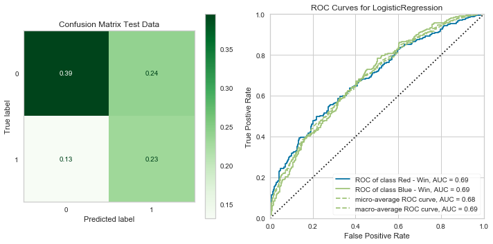


    ---- Timer stopped at: 04/27/2020 - 09:47 PM ----
    ---- Time elasped: 0:00:00.705115 ----
    


    DecisionTreeClassifier(ccp_alpha=0.0, class_weight='balanced', criterion='gini',
                           max_depth=None, max_features=None, max_leaf_nodes=None,
                           min_impurity_decrease=0.0, min_impurity_split=None,
                           min_samples_leaf=1, min_samples_split=2,
                           min_weight_fraction_leaf=0.0, presort='deprecated',
                           random_state=None, splitter='best')


    Classification Report Test
                  precision    recall  f1-score   support
    
               0       0.67      0.68      0.68       457
               1       0.43      0.42      0.43       262
    
        accuracy                           0.59       719
       macro avg       0.55      0.55      0.55       719
    weighted avg       0.58      0.59      0.58       719
    
    


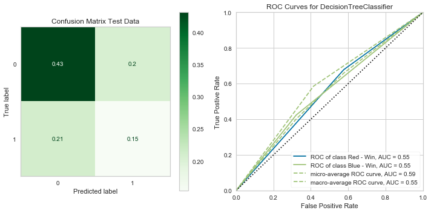


    ---- Timer stopped at: 04/27/2020 - 09:47 PM ----
    ---- Time elasped: 0:00:00.896603 ----
    


    RandomForestClassifier(bootstrap=True, ccp_alpha=0.0, class_weight='balanced',
                           criterion='gini', max_depth=None, max_features='auto',
                           max_leaf_nodes=None, max_samples=None,
                           min_impurity_decrease=0.0, min_impurity_split=None,
                           min_samples_leaf=1, min_samples_split=2,
                           min_weight_fraction_leaf=0.0, n_estimators=100,
                           n_jobs=None, oob_score=False, random_state=None,
                           verbose=0, warm_start=False)


    Classification Report Test
                  precision    recall  f1-score   support
    
               0       0.66      0.92      0.77       457
               1       0.53      0.15      0.24       262
    
        accuracy                           0.64       719
       macro avg       0.59      0.54      0.50       719
    weighted avg       0.61      0.64      0.57       719
    
    


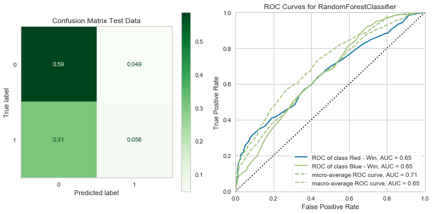


    ---- Timer stopped at: 04/27/2020 - 09:47 PM ----
    ---- Time elasped: 0:00:02.875342 ----
    


    KNeighborsClassifier(algorithm='auto', leaf_size=30, metric='minkowski',
                         metric_params=None, n_jobs=None, n_neighbors=5, p=2,
                         weights='uniform')


    Classification Report Test
                  precision    recall  f1-score   support
    
               0       0.67      0.81      0.73       457
               1       0.48      0.31      0.38       262
    
        accuracy                           0.62       719
       macro avg       0.57      0.56      0.55       719
    weighted avg       0.60      0.62      0.60       719
    
    


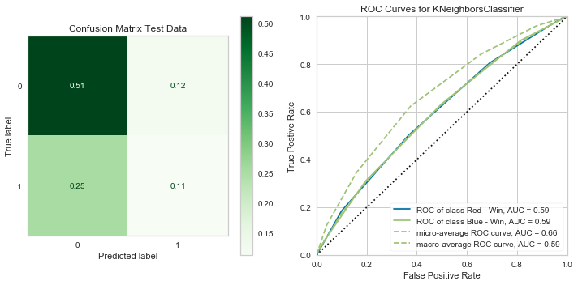


    ---- Timer stopped at: 04/27/2020 - 09:47 PM ----
    ---- Time elasped: 0:00:07.565786 ----
    


    AdaBoostClassifier(algorithm='SAMME.R', base_estimator=None, learning_rate=1.0,
                       n_estimators=50, random_state=None)


    Classification Report Test
                  precision    recall  f1-score   support
    
               0       0.68      0.81      0.74       457
               1       0.51      0.35      0.41       262
    
        accuracy                           0.64       719
       macro avg       0.60      0.58      0.58       719
    weighted avg       0.62      0.64      0.62       719
    
    


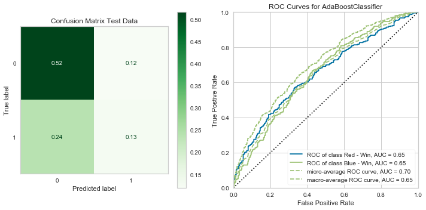


    ---- Timer stopped at: 04/27/2020 - 09:47 PM ----
    ---- Time elasped: 0:00:02.303829 ----
    


    GradientBoostingClassifier(ccp_alpha=0.0, criterion='friedman_mse', init=None,
                               learning_rate=0.1, loss='deviance', max_depth=3,
                               max_features=None, max_leaf_nodes=None,
                               min_impurity_decrease=0.0, min_impurity_split=None,
                               min_samples_leaf=1, min_samples_split=2,
                               min_weight_fraction_leaf=0.0, n_estimators=100,
                               n_iter_no_change=None, presort='deprecated',
                               random_state=None, subsample=1.0, tol=0.0001,
                               validation_fraction=0.1, verbose=0,
                               warm_start=False)


    Classification Report Test
                  precision    recall  f1-score   support
    
               0       0.67      0.89      0.77       457
               1       0.56      0.24      0.34       262
    
        accuracy                           0.65       719
       macro avg       0.61      0.57      0.55       719
    weighted avg       0.63      0.65      0.61       719
    
    


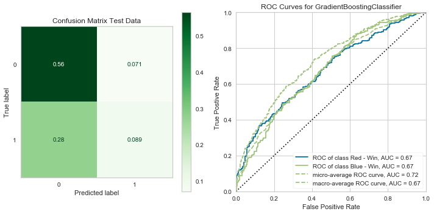


    ---- Timer stopped at: 04/27/2020 - 09:47 PM ----
    ---- Time elasped: 0:00:07.590721 ----
    


    XGBClassifier(base_score=0.5, booster='gbtree', colsample_bylevel=1,
                  colsample_bytree=1, gamma=0, learning_rate=0.1, max_delta_step=0,
                  max_depth=3, min_child_weight=1, missing=None, n_estimators=100,
                  n_jobs=1, nthread=None, objective='binary:logistic',
                  random_state=0, reg_alpha=0, reg_lambda=1, scale_pos_weight=1,
                  seed=None, silent=True, subsample=1)


    Classification Report Test
                  precision    recall  f1-score   support
    
               0       0.68      0.88      0.76       457
               1       0.55      0.27      0.36       262
    
        accuracy                           0.66       719
       macro avg       0.62      0.57      0.56       719
    weighted avg       0.63      0.66      0.62       719
    
    


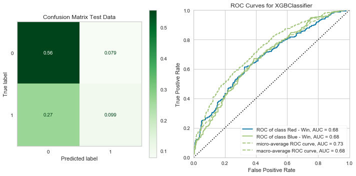


    ---- Timer stopped at: 04/27/2020 - 09:47 PM ----
    ---- Time elasped: 0:00:02.228032 ----
    

#### Re-tune 2.0


```python
#ada_clf_bin2 = AdaBoostClassifier()
#log_clf_bin2 = LogisticRegression(class_weight='balanced', solver='liblinear')
```


```python
log_params_bin_skim = {'C': [0.5, 1e10, 1e5],
                  'solver': ['liblinear', 'saga']}

log_gridsrch_bin_skim = dlf.grid_searcher(log_clf_bin2, log_params_bin_skim, X_trn_sca_resmp_bin_skim,
                                 X_test_sca_bin_skim, y_trn_resmp_bin_skim, y_test_bin_skim, cv=3)
```

    ---- Timer stopped at: 04/27/2020 - 09:49 PM ----
    ---- Time elasped: 0:00:13.517857 ----
    Mean Training Score: 70.41%
    Mean Test Score: 60.92%
    Best Parameters:
    {'C': 10000000000.0, 'solver': 'liblinear'}
    


```python
log_params_bin_skim2 = {'C': [10],
                  'solver': ['liblinear', 'saga']}

log_gridsrch_bin_skim2 = dlf.grid_searcher(log_clf_bin2, log_params_bin_skim2, X_trn_sca_resmp_bin_skim,
                                 X_test_sca_bin_skim, y_trn_resmp_bin_skim, y_test_bin_skim, cv=3)
```

    ---- Timer stopped at: 04/27/2020 - 09:49 PM ----
    ---- Time elasped: 0:00:02.659925 ----
    Mean Training Score: 70.57%
    Mean Test Score: 60.92%
    Best Parameters:
    {'C': 10, 'solver': 'liblinear'}
    


```python
ada_params_bin_skim = {'n_estimators': [100],
                       'learning_rate': [0.1, 0.175],
                       'base_estimator': [LogisticRegression(C=10, solver='saga')]}

ada_gridsrch_bin_skim = dlf.grid_searcher(ada_clf_bin2, ada_params_bin_skim, X_trn_sca_resmp_bin_skim,
                                 X_test_sca_bin_skim, y_trn_resmp_bin_skim, y_test_bin_skim, cv=3)
```

    ---- Timer stopped at: 04/27/2020 - 09:56 PM ----
    ---- Time elasped: 0:06:59.069704 ----
    Mean Training Score: 64.85%
    Mean Test Score: 62.87%
    Best Parameters:
    {'base_estimator': LogisticRegression(C=10, class_weight=None, dual=False, fit_intercept=True,
                       intercept_scaling=1, l1_ratio=None, max_iter=100,
                       multi_class='auto', n_jobs=None, penalty='l2',
                       random_state=None, solver='saga', tol=0.0001, verbose=0,
                       warm_start=False), 'learning_rate': 0.175, 'n_estimators': 100}
    


```python
ada_params_bin_skim2 = {'n_estimators': [1000],
                       'learning_rate': [0.175],
                       'base_estimator': [LogisticRegression(C=100000, solver='liblinear')]}

ada_gridsrch_bin_skim2 = dlf.grid_searcher(ada_clf_bin2, ada_params_bin_skim2, X_trn_sca_resmp_bin_skim,
                                 X_test_sca_bin_skim, y_trn_resmp_bin_skim, y_test_bin_skim, cv=3)
```

    ---- Timer stopped at: 04/27/2020 - 10:04 PM ----
    ---- Time elasped: 0:07:24.547366 ----
    Mean Training Score: 70.58%
    Mean Test Score: 60.36%
    Best Parameters:
    {'base_estimator': LogisticRegression(C=100000, class_weight=None, dual=False, fit_intercept=True,
                       intercept_scaling=1, l1_ratio=None, max_iter=100,
                       multi_class='auto', n_jobs=None, penalty='l2',
                       random_state=None, solver='liblinear', tol=0.0001, verbose=0,
                       warm_start=False), 'learning_rate': 0.175, 'n_estimators': 1000}
    


```python
log_skim1 = log_gridsrch_bin_skim.best_estimator_
log_skim2 = log_gridsrch_bin_skim2.best_estimator_
ada_skim = ada_gridsrch_bin_skim2.best_estimator_
```


```python
mods_skim_fin = [log_skim1, log_skim2, ada_skim]
mod_labs_skim_fin = ['log_skim1', 'log_skim2', 'ada_skim']
t_skim_fin = dlf.Timer()

times_skim_fin = dlf.time_models(X_trn_sca_resmp_bin_skim, X_test_sca_bin_skim, y_trn_resmp_bin_skim, y_test_bin_skim, mods_skim_fin, mod_labs_skim_fin, t_skim_fin, cls_lab=labs_bin)
```


    LogisticRegression(C=10000000000.0, class_weight='balanced', dual=False,
                       fit_intercept=True, intercept_scaling=1, l1_ratio=None,
                       max_iter=100, multi_class='auto', n_jobs=None, penalty='l2',
                       random_state=None, solver='liblinear', tol=0.0001, verbose=0,
                       warm_start=False)


    Classification Report Test
                  precision    recall  f1-score   support
    
               0       0.73      0.61      0.66       457
               1       0.47      0.61      0.53       262
    
        accuracy                           0.61       719
       macro avg       0.60      0.61      0.60       719
    weighted avg       0.64      0.61      0.62       719
    
    


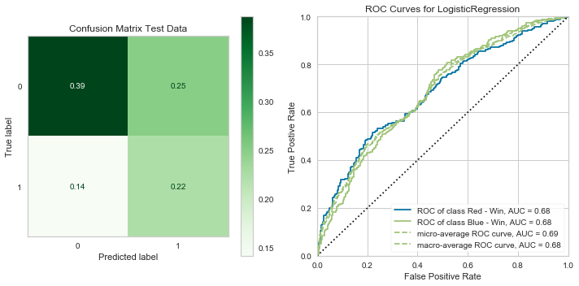


    ---- Timer stopped at: 04/27/2020 - 10:05 PM ----
    ---- Time elasped: 0:00:02.478348 ----
    


    LogisticRegression(C=10, class_weight='balanced', dual=False,
                       fit_intercept=True, intercept_scaling=1, l1_ratio=None,
                       max_iter=100, multi_class='auto', n_jobs=None, penalty='l2',
                       random_state=None, solver='liblinear', tol=0.0001, verbose=0,
                       warm_start=False)


    Classification Report Test
                  precision    recall  f1-score   support
    
               0       0.73      0.61      0.67       457
               1       0.47      0.60      0.53       262
    
        accuracy                           0.61       719
       macro avg       0.60      0.61      0.60       719
    weighted avg       0.64      0.61      0.62       719
    
    


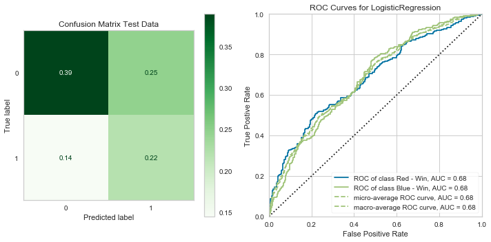


    ---- Timer stopped at: 04/27/2020 - 10:05 PM ----
    ---- Time elasped: 0:00:00.954477 ----
    


    AdaBoostClassifier(algorithm='SAMME.R',
                       base_estimator=LogisticRegression(C=100000,
                                                         class_weight=None,
                                                         dual=False,
                                                         fit_intercept=True,
                                                         intercept_scaling=1,
                                                         l1_ratio=None,
                                                         max_iter=100,
                                                         multi_class='auto',
                                                         n_jobs=None, penalty='l2',
                                                         random_state=None,
                                                         solver='liblinear',
                                                         tol=0.0001, verbose=0,
                                                         warm_start=False),
                       learning_rate=0.175, n_estimators=1000, random_state=None)


    Classification Report Test
                  precision    recall  f1-score   support
    
               0       0.72      0.61      0.66       457
               1       0.47      0.59      0.52       262
    
        accuracy                           0.60       719
       macro avg       0.59      0.60      0.59       719
    weighted avg       0.63      0.60      0.61       719
    
    


    ---- Timer stopped at: 04/27/2020 - 10:08 PM ----
    ---- Time elasped: 0:03:04.412768 ----
    

> It has actually lowered the accuracy! I will stick with my 2nd model moving forward.

## Final Results

> Throughout the duration of this project, I have created and tuned three models looking at the data three different ways. My results and correspsonding model parameters are as follows:

##### Multiclass Classifier


```python
#multi_y_trn, multi_y_te = fit_n_pred(xgb_fin, X_trn_sca_resmp, X_test_sca, y_trn_resmp)
```


```python
dlf.summarize_model(xgb_fin, X_trn_sca_resmp, X_test_sca, y_trn_resmp, y_test, tree=True)
```


    XGBClassifier(base_score=0.5, booster='gbtree', colsample_bylevel=1,
                  colsample_bytree=1, gamma=0, learning_rate=0.05, max_delta_step=0,
                  max_depth=2, min_child_weight=1, missing=None, n_estimators=50,
                  n_jobs=1, nthread=None, num_class=3, objective='multi:softprob',
                  random_state=0, reg_alpha=0, reg_lambda=1, scale_pos_weight=1,
                  seed=None, silent=True, subsample=1)


    Classification Report:
                  precision    recall  f1-score   support
    
               0       0.02      0.09      0.04        23
               1       0.72      0.71      0.71       845
               2       0.46      0.41      0.44       418
    
        accuracy                           0.60      1286
       macro avg       0.40      0.40      0.40      1286
    weighted avg       0.63      0.60      0.61      1286
    
    


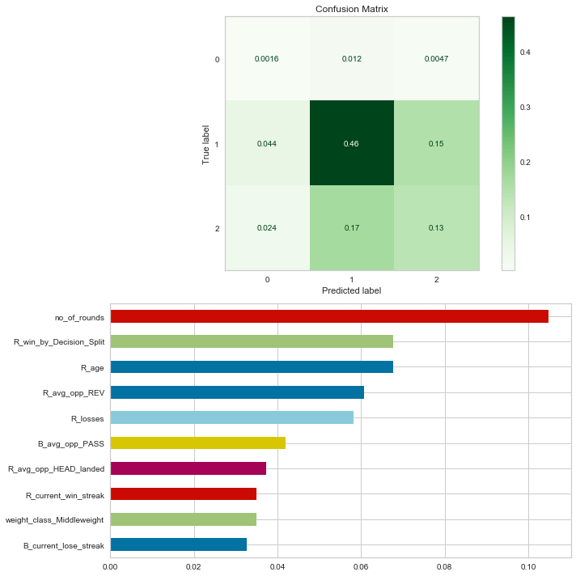


##### Binary Classifier (No Draws)


```python
#y_hat_trn_bin, y_hat_te_bin = fit_n_pred(log_clf_bin_fin, X_trn_sca_resmp_bin, X_test_sca_bin, y_trn_resmp_bin)
```


```python
dlf.summarize_model(log_clf_bin_fin, X_trn_sca_resmp_bin, X_test_sca_bin, y_trn_resmp_bin, y_test_bin)
```


    LogisticRegression(C=1, class_weight='balanced', dual=False, fit_intercept=True,
                       intercept_scaling=1, l1_ratio=None, max_iter=100,
                       multi_class='auto', n_jobs=None, penalty='l2',
                       random_state=None, solver='liblinear', tol=0.0001, verbose=0,
                       warm_start=False)


    Classification Report:
                  precision    recall  f1-score   support
    
               0       0.78      0.69      0.73       850
               1       0.49      0.61      0.54       416
    
        accuracy                           0.66      1266
       macro avg       0.64      0.65      0.64      1266
    weighted avg       0.69      0.66      0.67      1266
    
    


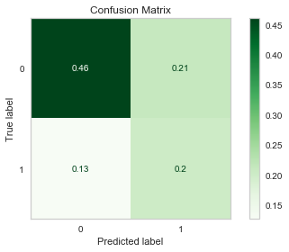


```python
bin_full_test_probs = log_clf_bin_fin.predict_proba(X_test_sca_bin)
bin_full_test_probs
```


    array([[0.35900333, 0.64099667],
           [0.45309112, 0.54690888],
           [0.78566549, 0.21433451],
           ...,
           [0.5289652 , 0.4710348 ],
           [0.57125872, 0.42874128],
           [0.86817068, 0.13182932]])


##### Binary Classifier (No rookies)


```python
#y_hat_trn_skim, y_hat_te_skim = fit_n_pred(log_skim1, X_train_sca_bin_skim, X_test_sca_bin_skim, y_train_bin_skim)
```


```python
dlf.summarize_model(log_skim1, X_trn_sca_resmp_bin_skim, X_test_sca_bin_skim, y_trn_resmp_bin_skim, y_test_bin_skim)
```


    LogisticRegression(C=10000000000.0, class_weight='balanced', dual=False,
                       fit_intercept=True, intercept_scaling=1, l1_ratio=None,
                       max_iter=100, multi_class='auto', n_jobs=None, penalty='l2',
                       random_state=None, solver='liblinear', tol=0.0001, verbose=0,
                       warm_start=False)


    Classification Report:
                  precision    recall  f1-score   support
    
               0       0.73      0.61      0.66       457
               1       0.47      0.61      0.53       262
    
        accuracy                           0.61       719
       macro avg       0.60      0.61      0.60       719
    weighted avg       0.64      0.61      0.62       719
    
    


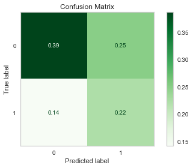


```python
bin_skim_test_probs = log_skim1.predict_proba(X_test_sca_bin_skim)
bin_skim_test_probs
```


    array([[0.233598  , 0.766402  ],
           [0.37351678, 0.62648322],
           [0.64074403, 0.35925597],
           ...,
           [0.89681032, 0.10318968],
           [0.63998927, 0.36001073],
           [0.70465062, 0.29534938]])


### Recommendation & Future Work

> Given these results, I would recommend using one of the two binary classification models to make their predicitions. Out of the two, I recommend the model trained on data containing 1st time fighters `log_clf_bin_fin`, as it has already seen data as such and over time with further development, be able to make a better prediction if fed that data.

> The reasoning behind choosing this model is for its purpose: **to allow interested parties to have a probability value** associated with any given fighter to win the match. Although 66% overall accuracy is not high, this model recieved this score by correctly guessing over *both* classes (46%, 20%); whereas other modeling attempts correctly guessed *one* class ~65% right while missing almost all of guesses at the other. 

> As for the multi-class model, being unable to predict a draw at all is something that may require *more* data preprocessing or a different modeling strategy. Looking at the confusion matrix for it, the model clearly only predicted actual wins by either corner, which is why I decided to drop that class entirely.

> If these models were to be used in any capacity, I can tailor the input features to whatever is necessary. As-is, I would expect it to be run using the same information scraped from [ufcstats.com](http://www.ufcstats.com/statistics/events/completed), but could always be altered to accept different subsets of features. 

> Additionally, combat sports by nature are very volatile when it comes to determining a winner. There are numerous ways to "get lucky" and steal a win, or to simply be in bad shape. There are intangibles such as "having heart" or a "strong chin" that would be difficult to quantify. In addition, important information such as fighting styles or what training camp they fight for could prove to be valuable to my model. Otherwise, given more time I would like to play more with what attributes I can add (or remove) in order to inch my accuracy higher. 
